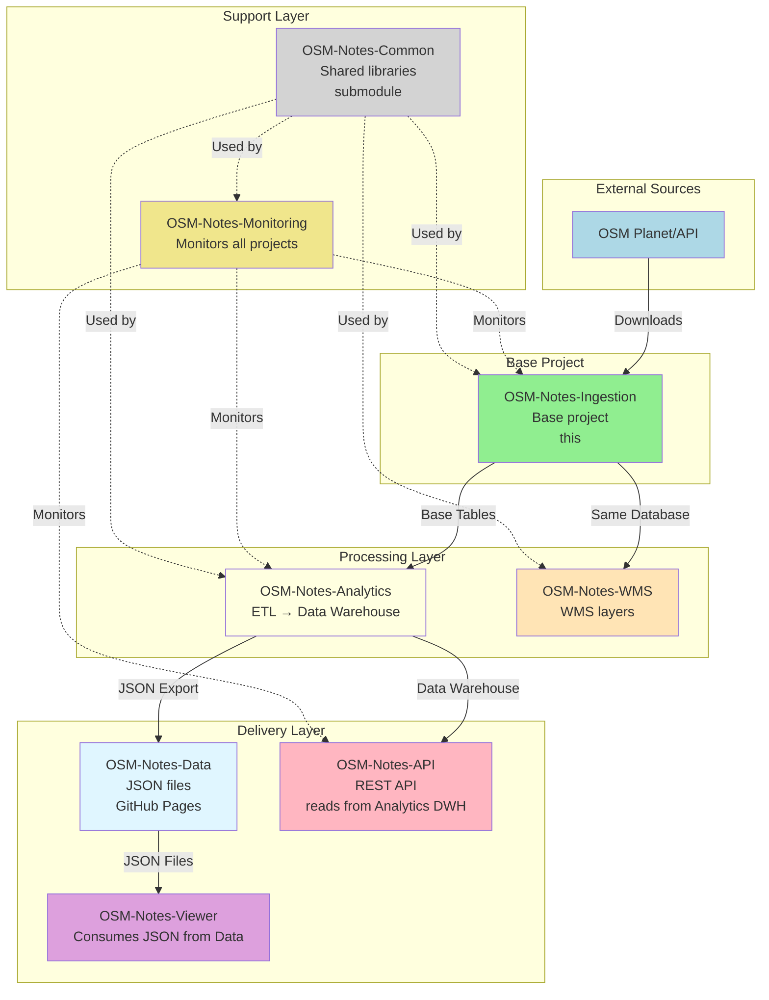

# OSM-Notes-Ingestion

**Data Ingestion for OpenStreetMap Notes**

This repository handles downloading, processing, and publishing OSM notes data.
It provides:

- Notes ingestion from OSM Planet and API
- Real-time synchronization with the main OSM database
- Data monitoring and validation

> **Note:** The analytics, data warehouse, and ETL components have been moved to
> [OSM-Notes-Analytics](https://github.com/OSM-Notes/OSM-Notes-Analytics).

## Data License

**Important:** This repository contains only code and configuration files. All data processed by this system comes from **OpenStreetMap (OSM)** and is licensed under the **Open Database License (ODbL)**. The processed data (notes, boundaries, etc.) stored in the database is derived from OSM and must comply with OSM's licensing requirements.

- **OSM Data License:** [Open Database License (ODbL)](http://opendatacommons.org/licenses/odbl/)
- **OSM Copyright:** [OpenStreetMap contributors](http://www.openstreetmap.org/copyright)
- **OSM Attribution:** Required when using or distributing OSM data

For more information about OSM licensing, see: [https://www.openstreetmap.org/copyright](https://www.openstreetmap.org/copyright)

## GDPR Compliance

**Important:** This system processes personal data from OpenStreetMap, including
usernames (which may contain real names) and geographic locations (which may
reveal where users live or frequent). We are committed to GDPR compliance.

- **Privacy Policy:** See [docs/GDPR_Privacy_Policy.md](./docs/GDPR_Privacy_Policy.md)
  for detailed information about data processing, retention, and your rights
- **GDPR Procedures:** See [docs/GDPR_Procedures.md](./docs/GDPR_Procedures.md)
  for procedures on handling data subject requests
- **GDPR SQL Scripts:** See [sql/gdpr/README.md](./sql/gdpr/README.md) for SQL
  scripts to handle GDPR requests

### Data Subject Rights

You have the right to:

- **Access** your personal data (Article 15)
- **Rectification** of inaccurate data (Article 16)
- **Erasure** (Right to be forgotten) under specific conditions (Article 17)
- **Data portability** (Article 20)
- **Object** to processing (Article 21)

To exercise your rights, contact: notes@osm.lat

## tl;dr - 5 minutes configuration

### Step 0: Install Directories (Production Only)

For production, install directories for persistent logs, temporary files, and lock files:

```bash
# Install directories (requires sudo)
sudo bin/scripts/install_directories.sh
```

This script creates:
- `/var/log/osm-notes-ingestion/` - Log files (with subdirectories: daemon, processing, monitoring)
- `/var/tmp/osm-notes-ingestion/` - Temporary files (with subdirectories: planet, overpass, api)
- `/var/run/osm-notes-ingestion/` - Lock files (**required for daemon operation**)

The script sets proper ownership (`notes:maptimebogota` by default) and permissions:
- Logs: `755` (readable by group, writable by owner)
- Temp: `775` (writable by owner and group)
- Locks: `775` (writable by owner and group)

**Important:** The lock directory (`/var/run/osm-notes-ingestion`) is critical for the daemon service. If it doesn't exist or isn't writable, the service will fail with exit code 241 (`CONFIGURATION_DIRECTORY`).

**Note:** For development/testing, you can skip this step. The system will automatically use fallback mode (`/tmp` directories). See `docs/Local_Setup.md` for details.

### Recommended: Daemon Mode (systemd)

For production use, the daemon mode is recommended for lower latency (30-60 seconds vs 15 minutes):

```bash
# Ensure directories are installed (see Step 0 above)
sudo bin/scripts/install_directories.sh

# Install systemd service
sudo cp examples/systemd/osm-notes-ingestion-daemon.service /etc/systemd/system/
sudo systemctl daemon-reload
sudo systemctl enable osm-notes-ingestion-daemon
sudo systemctl start osm-notes-ingestion-daemon

# Verify service is running
sudo systemctl status osm-notes-ingestion-daemon.service
```

**Prerequisites for daemon:**
- Directories must be installed (see Step 0)
- Lock directory `/var/run/osm-notes-ingestion` must exist and be writable
- PostgreSQL extensions `postgis` and `btree_gist` must be created in the database

See `docs/Process_API.md` "Daemon Mode" section for details.

### Alternative: Cron Mode (Legacy)

If systemd is not available, you can use cron:

```text
*/15 * * * * ~/OSM-Notes-Ingestion/bin/process/processAPINotes.sh
```

The configuration file contains the properties needed to configure this tool,
especially the database properties.

## Main functions

These are the main functions of this project:

- **Notes Ingestion**: Download notes from the OSM Planet and keep data in sync
  with the main OSM database via API calls.
  This is configured with a daemon (systemd) that polls every minute, or
  optionally with a scheduler (cron) as an alternative.
- **Country Boundaries**: Updates the current country and maritime information.
  This should be run once a month.
- **Data Monitoring**: Monitor the sync by comparing the daily Planet dump with the notes on the
  database.
  This is optional and can be configured daily with a cron.

## 📚 Ecosystem Documentation

For shared documentation of the complete ecosystem, see:

- **[OSM Notes Ecosystem](https://github.com/OSM-Notes/OSM-Notes)** - Ecosystem landing page
- **[Global Glossary](https://github.com/OSM-Notes/OSM-Notes-Common/blob/main/docs/Glossary.md)** - Terms and definitions
- **[Ecosystem installation index](https://github.com/OSM-Notes/OSM-Notes-Common/blob/main/docs/Installation.md)** -
  Suggested dependency order and links to each project's authoritative install docs
- **[End-to-End Data Flow](https://github.com/OSM-Notes/OSM-Notes-Common/blob/main/docs/Data_Flow.md)** - Complete data flow
- **[Decision Guide](https://github.com/OSM-Notes/OSM-Notes-Common/blob/main/docs/Decision_Guide.md)** - Which project do I need?

---

## OSM-Notes Ecosystem

This project is part of the **OSM-Notes ecosystem**, consisting of 8 interconnected projects.
**OSM-Notes-Ingestion is the base project** - it was the first created and provides the foundation
for all others.

### Ecosystem Projects

1. **[OSM-Notes-Ingestion](https://github.com/OSM-Notes/OSM-Notes-Ingestion)** (this project) - **Base project**
   - Downloads and synchronizes OSM notes from Planet and API
   - Populates base PostgreSQL tables
   - First project created, foundation for all others

2. **[OSM-Notes-Analytics](https://github.com/OSM-Notes/OSM-Notes-Analytics)**
   - ETL processes and data warehouse
   - Generates analytics and datamarts
   - **Requires**: OSM-Notes-Ingestion (reads from base tables)

3. **[OSM-Notes-API](https://github.com/OSM-Notes/OSM-Notes-API)**
   - REST API for programmatic access
   - Provides dynamic queries and advanced features
   - **Requires**: OSM-Notes-Analytics (reads from data warehouse)

4. **[OSM-Notes-Viewer](https://github.com/OSM-Notes/OSM-Notes-Viewer)**
   - Web application for interactive visualization
   - Consumes JSON data from OSM-Notes-Data (GitHub Pages)
   - **Requires**: OSM-Notes-Data (which is generated by OSM-Notes-Analytics)

5. **[OSM-Notes-WMS](https://github.com/OSM-Notes/OSM-Notes-WMS)**
   - Web Map Service for geographic visualization
   - Publishes WMS layers for mapping applications
   - **Requires**: OSM-Notes-Ingestion (uses same database)

6. **[OSM-Notes-Monitoring](https://github.com/OSM-Notes/OSM-Notes-Monitoring)**
   - Centralized monitoring and alerting
   - Monitors all ecosystem components
   - **Requires**: Access to all other projects' databases/services

7. **[OSM-Notes-Common](https://github.com/OSM-Notes/OSM-Notes-Common)**
   - Shared Bash libraries and utilities
   - Used as Git submodule by multiple projects
   - **Used by**: Ingestion, Analytics, WMS, Monitoring

8. **[OSM-Notes-Data](https://github.com/OSM-Notes/OSM-Notes-Data)**
   - JSON data files exported from Analytics
   - Served via GitHub Pages
   - **Requires**: OSM-Notes-Analytics (generates and publishes the data)
   - **Consumed by**: Viewer (primary consumer), API (optional)

### Project Relationships



### Installation Order

When setting up the complete ecosystem, install projects in this order:

1. **OSM-Notes-Ingestion** (this project) - Install first
2. **OSM-Notes-Analytics** - Requires Ingestion
3. **OSM-Notes-WMS** - Requires Ingestion
4. **OSM-Notes-Data** - Requires Analytics (auto-generated by Analytics export script)
5. **OSM-Notes-Viewer** - Requires Data (consumes JSON from GitHub Pages)
6. **OSM-Notes-API** - Requires Analytics (reads from Analytics data warehouse)
7. **OSM-Notes-Monitoring** - Requires all others (monitors them)
8. **OSM-Notes-Common** - Used as submodule (no installation needed)

For more information about each project, visit their respective repositories.

## Requirements

### Application Requirements

- **PostgreSQL** 12+ with PostGIS extension
- **Bash** 4.0 or higher
- **Linux** operating system
- **Standard UNIX utilities**: grep, awk, sed, curl, jq
- **Parallel processing**: GNU parallel
- **XML validation** (optional): libxml2-utils (if `SKIP_XML_VALIDATION=false`)
- **Geographic tools**: GDAL, osmtogeojson (npm)
- **JSON validation**: ajv-cli (npm)
- **Email notifications**: mutt (for monitoring alerts)

For detailed installation instructions, see:
- **[Installation and Dependencies Guide](docs/Installation_Dependencies.md)** - Complete installation guide with all dependencies
- [Install prerequisites on Ubuntu](#install-prerequisites-on-ubuntu) section below - Quick Ubuntu setup

### Internal Repository Requirements

**None** - This is the base project and has no dependencies on other OSM-Notes repositories.

However, other projects depend on this one:
- **OSM-Notes-Analytics** requires this project (reads from base tables)
- **OSM-Notes-WMS** requires this project (uses same database)
- **OSM-Notes-Monitoring** monitors this project

## Shared Functions (Git Submodule)

This project uses a Git submodule for shared code (`lib/osm-common/`):

- **Common Functions** (`commonFunctions.sh`): Core utility functions
- **Validation Functions** (`validationFunctions.sh`): Data validation
- **Error Handling** (`errorHandlingFunctions.sh`): Error handling and recovery
- **Logger** (`bash_logger.sh`): Logging library (log4j-style)

These functions are shared with [OSM-Notes-Analytics](https://github.com/OSM-Notes/OSM-Notes-Analytics)
via the [OSM-Notes-Common](https://github.com/OSM-Notes/OSM-Notes-Common) submodule.

### Cloning with Submodules

```bash
# Clone with submodules (recommended)
git clone --recurse-submodules https://github.com/OSM-Notes/OSM-Notes-Ingestion.git

# Or initialize after cloning
git clone https://github.com/OSM-Notes/OSM-Notes-Ingestion.git
cd OSM-Notes-Ingestion
git submodule update --init --recursive
```

### Troubleshooting: Submodule Issues

If you encounter the error `/lib/osm-common/commonFunctions.sh: No such file or directory`, the submódule has not been initialized. To fix:

```bash
# Initialize and update submodules
git submodule update --init --recursive

# Verify submodule exists
ls -la lib/osm-common/commonFunctions.sh

# If still having issues, re-initialize completely
git submodule deinit -f lib/osm-common
git submodule update --init --recursive
```

To check submodule status:

```bash
git submodule status
```

If the submodule is not properly initialized, you'll see a `-` prefix in the status output.

#### Authentication Issues

If you encounter authentication errors:

**For SSH (recommended):**

```bash
# Test SSH connection to GitHub
ssh -T git@github.com

# If connection fails, set up SSH keys:
# 1. Generate SSH key: ssh-keygen -t ed25519
# 2. Add public key to GitHub: cat ~/.ssh/id_ed25519.pub
# 3. Add key at: https://github.com/settings/keys
```

**For HTTPS:**

```bash
# Use GitHub Personal Access Token instead of password
# Create token at: https://github.com/settings/tokens
# Then clone: git clone https://YOUR_TOKEN@github.com/...
```

See [Submodule Troubleshooting Guide](./docs/Submodule_Troubleshooting.md) for detailed instructions.

## Getting Started for Contributors

If you're new to this project and want to understand the codebase or contribute, follow this reading path:

### Recommended Reading Path (~2-3 hours)

1. **Start Here** (15 min)
   - Read this README.md (you're here!)
   - Understand the project purpose and main functions
   - Review the directory structure below

2. **Project Context** (30 min)
   - Read [HISTORY.md](./HISTORY.md) - Project history and origins (OpenNotesLatam)
   - Read [docs/Rationale.md](./docs/Rationale.md) - Why this project exists
   - Read [docs/Documentation.md](./docs/Documentation.md) - System architecture overview

3. **Core Processing** (45 min)
   - Read [docs/Process_API.md](./docs/Process_API.md) - API processing workflow
   - Read [docs/Process_Planet.md](./docs/Process_Planet.md) - Planet file processing

4. **Entry Points** (20 min)
   - Read [bin/ENTRY_POINTS.md](./bin/Entry_Points.md) - Which scripts can be called directly
   - Understand the main entry points: `processAPINotes.sh`, `processPlanetNotes.sh`, `updateCountries.sh`

5. **Testing** (30 min)
   - Read [docs/Testing_Guide.md](./docs/Testing_Guide.md) - How to run and write tests
   - Review [docs/Test_Execution_Guide.md](./docs/Test_Execution_Guide.md) - Test execution workflows

6. **Deep Dive** (as needed)
   - Explore specific components in `bin/`, `sql/`, `tests/`
   - Review [docs/README.md](./docs/README.md) for complete documentation index

### Project Structure

```
OSM-Notes-Ingestion/
├── bin/                    # Executable scripts
│   ├── process/           # Main processing scripts (entry points)
│   ├── monitor/           # Monitoring and validation scripts
│   ├── scripts/           # Utility scripts
│   └── lib/               # Shared library functions
├── sql/                   # SQL scripts (mirrors bin/ structure)
│   ├── process/           # Database operations for processing
│   ├── monitor/           # Monitoring queries
│   └── analysis/          # Performance analysis scripts
├── tests/                 # Comprehensive test suite
│   ├── unit/              # Unit tests (bash, SQL)
│   ├── integration/       # Integration tests
│   └── mock_commands/     # Mock commands for testing
├── docs/                  # Complete documentation
│   ├── Documentation.md   # System architecture
│   ├── Rationale.md       # Project motivation
│   ├── Process_API.md      # API processing details
│   └── Process_Planet.md   # Planet processing details
├── etc/                   # Configuration files
│   └── properties.sh      # Main configuration
├── lib/osm-common/        # Git submodule (shared functions)
├── awk/                   # AWK scripts (XML to CSV conversion)
├── overpass/              # Overpass API queries
├── json/                  # JSON schemas and test data
├── xsd/                   # XML Schema definitions
└── data/                  # Data files and backups
```

### Key Concepts

- **Entry Points**: Only scripts in `bin/process/` should be called directly (see [ENTRY_POINTS.md](./bin/Entry_Points.md))
- **Processing Flow**: API → Database (see [Documentation.md](./docs/Documentation.md))
- **Testing**: 101 test suites covering all components (see [Testing_Guide.md](./docs/Testing_Guide.md))
- **Configuration**: All settings in `etc/properties.sh`

### Quick Start for Developers

1. **Clone with submodules:**
   ```bash
   git clone --recurse-submodules https://github.com/OSM-Notes/OSM-Notes-Ingestion.git
   ```

2. **Configure database** (see [Database Configuration](#database-configuration) section)

3. **Run tests:**
   ```bash
   ./tests/run_all_tests.sh
   ```

4. **Read entry points:**
   ```bash
   cat bin/ENTRY_POINTS.md
   ```

5. **Explore documentation:**
   ```bash
   cat docs/README.md
   ```

For complete documentation navigation, see [docs/README.md](./docs/README.md).

## Architecture Decision Records

Architecture Decision Records (ADRs) document important architectural decisions made in this project:
- [View all ADRs](docs/adr/)
- [Central ADR Index](https://github.com/OSM-Notes/OSM-Notes-Common/blob/main/docs/adr/README.md)

## Timing

The whole process takes several hours, even days to complete before the
profile can be used for any user.

**Notes initial load**

- 12 minutes: Downloading the countries and maritime areas.

  - Countries processing: ~10 minutes (6 parallel threads)
  - Maritime boundaries processing: ~2.5 minutes (6 parallel threads)
  - This process has a pause between calls because the public Overpass turbo is
    restricted by the number of requests per minute.
    If another Overpass instance is used that does not block when many requests,
    the pause could be removed or reduced.
- 1 minute: Download the Planet notes file.
- 5 minutes: Processing XML notes file.
- 15 minutes: Inserting notes into the database.
- 8 minutes: Processing and consolidating notes from partitions.
- 3 hours: Locating notes in the appropriate country (parallel processing).

  - This DB process is executed in parallel with multiple threads.

**Notes synchronization**

The synchronization process time depends on the frequency of the calls and the
number of comment actions.
If the notes API call is executed every 15 minutes, the complete process takes
less than 2 minutes to complete.

## Install prerequisites on Ubuntu

This is a simplified version of what you need to execute to run this project on Ubuntu.

```text
# Configure the PostgreSQL database.
sudo apt -y install postgresql
sudo systemctl start postgresql.service
sudo su - postgres
psql << EOF
CREATE USER notes SUPERUSER;
CREATE DATABASE notes WITH OWNER notes;
EOF
exit

# PostGIS extension for Postgres.
sudo apt -y install postgis
psql -d notes << EOF
CREATE EXTENSION postgis;
EOF

# Generalized Search Tree extension for Postgres.
psql -d notes << EOF
CREATE EXTENSION btree_gist
EOF

# Tool to download in parallel threads.
sudo apt install -y aria2

# Tools to validate XML (optional, only if SKIP_XML_VALIDATION=false).
sudo apt -y install libxml2-utils

# Process parts in parallel.
sudo apt install parallel
## jq (required for JSON/GeoJSON validation)
sudo apt install -y jq

# Tools to process geometries.
sudo apt -y install npm
sudo npm install -g osmtogeojson

# JSON validator.
sudo npm install ajv
sudo npm install -g ajv-cli

# Mail sender for notifications.
sudo apt install -y mutt

sudo add-apt-repository ppa:ubuntugis/ppa
sudo apt-get -y install gdal-bin

```

If you do not configure the prerequisites, each script validates the necessary
components to work.

## Automated Execution

### Recommended: Daemon Mode (systemd)

The daemon mode is the **recommended production solution** for automated execution. It provides lower latency (30-60 seconds vs 15 minutes) and better efficiency:

```bash
# Install systemd service
sudo cp examples/systemd/osm-notes-ingestion-daemon.service /etc/systemd/system/
sudo systemctl daemon-reload
sudo systemctl enable osm-notes-ingestion-daemon
sudo systemctl start osm-notes-ingestion-daemon
```

The daemon automatically:
- Polls the API every minute (configurable via `DAEMON_SLEEP_INTERVAL`)
- Handles initial setup automatically on first run (creates tables, loads historical data, loads countries)
- Processes API notes continuously
- Automatically syncs with Planet when needed (10K notes + new dump)

See `docs/Process_API.md` "Daemon Mode" section for detailed configuration.

### Maintenance and Monitoring Tasks (Cron)

While the main API notes processing runs as a daemon, you still need to configure cron for maintenance and monitoring tasks:

```text
# Country boundaries update: Once a month (first day at 2 AM)
0 2 1 * * ~/OSM-Notes-Ingestion/bin/process/updateCountries.sh

# Data verification and correction: Daily check and correction (6 AM)
# Corrects problems from API calls and identifies hidden notes (only detectable with Planet)
# Note: It's normal for this script to do nothing if tables are already correct.
0 6 * * * EMAILS="your-email@example.com" ~/OSM-Notes-Ingestion/bin/monitor/notesCheckVerifier.sh

# Database performance analysis: Monthly (first day at 3 AM)
0 3 1 * * ~/OSM-Notes-Ingestion/bin/monitor/analyzeDatabasePerformance.sh --db notes > ~/logs/db_performance_monthly_$(date +\%Y\%m\%d).log 2>&1
```

**Important**: 
- Do NOT add `processAPINotes.sh` to cron - it is handled by the daemon
- Do NOT add `processPlanetNotes.sh` to cron - it is automatically called by the daemon when needed
- Cron is only for maintenance (country updates) and monitoring (verification, performance analysis)

See `examples/crontab-setup.example` for detailed cron configuration examples.

For **ETL and Analytics scheduling**, see the [OSM-Notes-Analytics](https://github.com/OSM-Notes/OSM-Notes-Analytics) repository.

## Components description

### Configuration file

Before everything, you need to configure the database access and other
properties. **Important**: The actual configuration files are not tracked in Git
for security reasons. You must create them from the example files:

```bash
# Copy example files to create your local configuration
cp etc/properties.sh.example etc/properties.sh

# Edit the file with your database credentials and settings
vi etc/properties.sh
```

The example files contain default values and detailed comments. Replace the
example values (like `notes`, `changeme`, `your-email@domain.com`) with your
actual configuration.

**Important**: Make sure to update the `DOWNLOAD_USER_AGENT` email address
in `etc/properties.sh`. This follows OpenStreetMap best practices and allows
server administrators to contact you if there are issues with your requests.

Main configuration file: `etc/properties.sh` (created from `etc/properties.sh.example`)

You specify the database name and the user to access it.

Other properties are related to improving the parallelism to process the note's
location, or to use other URLs for Overpass or the API.

### Downloading notes

There are two ways to download OSM notes:

- Recent notes from the Planet (including all notes on the daily backup).
- Near real-time notes from API.

These two methods are used in this tool to initialize the DB and poll the API
periodically.
The two mechanisms are used, and they are available under the `bin` directory:

- `processAPINotes.sh`
- `processPlanetNotes.sh`

However, to configure from scratch, you just need to call
`processAPINotes.sh`.

If `processAPINotes.sh` cannot find the base tables, then it will invoke
`processPlanetNotes.sh` and `processPlanetNotes.sh --base` that will create the
basic elements on the database and populate it:

- Download countries and maritime areas.
- Download the Planet dump, validate it and convert it CSV to import it into
  the database.
  The conversion from the XML Planet dump to CSV is done with an XLST.
- Get the location of the notes.

If `processAPINotes.sh` gets more than 10,000 notes from an API call, then it
will synchronize the database calling `processPlanetNotes.sh` following this
process:

- Download the notes from the Planet.
- Remove the duplicates from the ones already in the DB.
- Process the new ones.
- Associate new notes with a country or maritime area.

If `processAPINotes.sh` gets less than 10,000 notes, it will process them
directly.

Note: If during the same day, there are more than 10,000 notes between two
`processAPINotes.sh` calls, it will remain unsynchronized until the Planet dump
is updated the next UTC day.
That's why it is recommended to perform frequent API calls.

You can run `processAPINotes.sh` from a crontab every 15 minutes, to process
notes almost in real-time.

### Logger

You can export the `LOG_LEVEL` variable, and then call the scripts normally.

```text
export LOG_LEVEL=DEBUG
./processAPINotes.sh
```

The levels are (case-sensitive):

- TRACE
- DEBUG
- INFO
- WARN
- ERROR
- FATAL

### Database

These are the table types on the database:

- Base tables (notes and note_comments) are the most important holding the
  whole history.
  They don't belong to a specific schema.
- API tables which contain the data for recently modified notes and comments.
  The data from these tables are then bulked into base tables.
  They don't belong to a specific schema, but a suffix.
- Sync tables contain the data from the recent planet download.
  They don't belong to a specific schema, but a suffix.
- `dwh` schema contains the data warehouse tables (managed by OSM-Notes-Analytics).
  See [OSM-Notes-Analytics](https://github.com/OSM-Notes/OSM-Notes-Analytics) for details.
- Check tables are used for monitoring to compare the notes on the previous day
  between the normal behavior with API and the notes on the last day of the
  Planet.

### Directories

Some directories have their own README file to explain their content.
These files include details about how to run or troubleshoot the scripts.

- `bin` contains all executable scripts for ingestion.
- `bin/monitor` contains scripts to monitor the notes database to
  validate it has the same data as the planet, and send email
  messages with differences.
- `bin/process` has the main scripts to download the notes database, with the
  Planet dump and via API calls.
- `etc` configuration file for many scripts.
- `json` JSON files for schema and testing.
- `lib` libraries used in the project.
  Currently only a modified version of bash logger.
- `overpass` queries to download data with Overpass for the countries and
  maritime boundaries.
- `sql` contains most of the SQL statements to be executed in Postgres.
  It follows the same directory structure from `/bin` where the prefix name is
  the same as the scripts on the other directory.
  This directory also contains a script to keep a copy of the locations of the
  notes in case of a re-execution of the whole Planet process.
  And also the script to remove everything related to this project from the DB.
- `sql/monitor` scripts to check the notes database, comparing it with a Planet
  dump.
- `sql/process` has all SQL scripts to load the notes database.
- **For DWH/ETL SQL scripts**, see [OSM-Notes-Analytics](https://github.com/OSM-Notes/OSM-Notes-Analytics).
- **For WMS layer publishing**, see [OSM-Notes-WMS](https://github.com/OSM-Notes/OSM-Notes-WMS).
- `test` set of scripts to perform tests.
  This is not part of a Unit Test set.
- `xsd` contains the structure of the XML documents to be retrieved - XML
  Schema.
  This helps validate the structure of the documents, preventing errors
  during the import from the Planet dump and API calls.
- `awk` contains all the AWK extraction scripts for the data retrieved from
  the Planet dump and API calls.
  They convert XML to CSV efficiently with minimal dependencies.

### Monitoring

This repository includes local monitoring scripts for data quality verification:

- **`bin/monitor/processCheckPlanetNotes.sh`**: Verifies Planet notes processing
  - Creates check tables with `_check` suffix
  - Compares differences between API process and Planet data
  - Best run around 6h UTC when OSM Planet file is published
- **`bin/monitor/notesCheckVerifier.sh`**: Validates note data integrity
- **`bin/monitor/analyzeDatabasePerformance.sh`**: Analyzes database performance

> **Note:** For centralized monitoring, alerting, and API security across all
> OSM Notes repositories, see [OSM-Notes-Monitoring](https://github.com/OSM-Notes/OSM-Notes-Monitoring).
> The scripts in `bin/monitor/` are specific to this repository and focus on
> data quality verification for ingestion.

If you find many differences, especially for comments older than one day, it
means the script failed in the past, and the best is to recreate the database
with the `processPlanetNotes.sh` script.
It is also recommended to create an issue in this GitHub repository, providing
as much information as possible.

For **WMS (Web Map Service) layer publication**, see the
[OSM-Notes-WMS](https://github.com/OSM-Notes/OSM-Notes-WMS) repository.

## Dependencies and libraries

These are the external dependencies to make it work.

- OSM Planet dump, which creates a daily file with all notes and comments.
  The file is an XML and it weighs several hundreds of MB of compressed data.
- Overpass to download the current boundaries of the countries and maritimes
  areas.
- OSM API which is used to get the most recent notes and comments.
  The current API version supported is 0.6.
- The whole process relies on a PostgreSQL database.
  It uses intensive SQL action to have a good performance when processing the
  data.

The external dependencies are almost fixed, however, they could be changed from
the properties file.

These are external libraries:

- bash_logger, which is a tool to write log4j-like messages in Bash.
  This tool is included as part of the project.
- Bash 4 or higher, because the main code is developed in the scripting
  language.
- Linux and its commands, because it is developed in Bash, which uses a lot
  of command line instructions.

## Remove

You can use the following script to remove components from this tool.
This is useful if you have to recreate some parts, but the rest is working fine.

```bash
# Remove all components from the database (uses default from properties: notes)
~/OSM-Notes-Ingestion/bin/cleanupAll.sh

# Clean only partitions
~/OSM-Notes-Ingestion/bin/cleanupAll.sh -p

# Change database in etc/properties.sh (DBNAME variable)
# Then run cleanup for that database
~/OSM-Notes-Ingestion/bin/cleanupAll.sh
```

**Note:** This script handles all components including partition tables, dependencies, and temporary files automatically. Manual cleanup is not recommended as it may leave partition tables or dependencies unresolved.

## Help

You can start looking for help by reading the README.md files.
Also, you run the scripts with -h or --help.
There are few Github wiki pages with interesting information.
You can even take a look at the code, which is highly documented.
Finally, you can create an issue or contact the author.

## Testing

The project includes comprehensive testing infrastructure with **101 test suite
files** (~1,000+ individual tests) covering all ingestion system components.

### Quick Start

```bash
# Run all tests (master test runner - recommended)
./tests/run_all_tests.sh

# Run simple tests (no sudo required)
./tests/run_tests_simple.sh

# Run integration tests
./tests/run_integration_tests.sh

# Run quality tests
./tests/run_quality_tests.sh

# Run logging pattern validation tests
./tests/run_logging_validation_tests.sh

# Run sequential tests by level
./tests/run_tests_sequential.sh quick  # 15-20 min
```

**Master Test Runner**: `tests/run_all_tests.sh` - Executes all test suites (unit, integration, quality)

**Note**: The project also includes `run_tests.sh` with advanced options (modes, types), but `run_all_tests.sh` is the standard master test runner.

### Test Categories

- **Unit Tests**: 86 bash suites + 6 SQL suites
- **Integration Tests**: 8 end-to-end workflow suites
- **Parallel Processing**: 1 comprehensive suite with 21 tests
- **Validation Tests**: Data validation, XML processing, error handling
- **Performance Tests**: Parallel processing, edge cases, optimization
- **Quality Tests**: Code quality, conventions, formatting
- **Logging Pattern Tests**: Logging pattern validation and compliance

### Test Coverage

- ✅ **Data Processing**: XML/CSV processing, transformations
- ✅ **System Integration**: Database operations, API integration
- ✅ **Quality Assurance**: Code quality, error handling, edge cases
- ✅ **Infrastructure**: Monitoring, configuration, tools and utilities
- ✅ **Logging Patterns**: Logging pattern validation and compliance across all scripts

### Documentation

- [Testing Suites Reference](./docs/Testing_Suites_Reference.md) - Complete list of all testing suites
- [Testing Guide](./docs/Testing_Guide.md) - Testing guidelines and workflows
- [Testing Workflows Overview](./docs/Testing_Workflows_Overview.md) - CI/CD testing workflows

For detailed testing information, see the [Testing Suites Reference](./docs/Testing_Suites_Reference.md) documentation.

## Database Configuration

The project uses PostgreSQL for data storage. Before running the scripts, ensure proper database configuration:

### Development Environment Setup

1. **Install PostgreSQL:**

   ```bash
   sudo apt-get update && sudo apt-get install postgresql
   ```

2. **Configure authentication (choose one option):**

   **Option A: Trust authentication (recommended for development)**

   ```bash
   sudo nano /etc/postgresql/15/main/pg_hba.conf
   # Change 'peer' to 'trust' for local connections
   sudo systemctl restart postgresql
   ```

   **Option B: Password authentication**

   ```bash
   echo "localhost:5432:notes:notes:your_password" > ~/.pgpass
   chmod 600 ~/.pgpass
   ```

3. **Test connection:**

   ```bash
   psql -U notes -d notes -c "SELECT 1;"
   ```

### Database Configuration

The project is configured to use:

- **Database:** `notes` (default from `etc/properties.sh.example`)
- **User:** `notes`
- **Authentication:** peer (uses system user)

Configuration is stored in `etc/properties.sh` (created from `etc/properties.sh.example`).

**Important**: Always create `etc/properties.sh` from the example file before
running the scripts. The actual file is not tracked in Git for security
reasons.

For troubleshooting, check the PostgreSQL logs and ensure proper authentication configuration.

### Local Development Setup

The configuration file (`etc/properties.sh`) is
already in `.gitignore` and will not be committed to the repository. This
ensures your local credentials and settings remain secure.

To set up your local configuration:

```bash
# Create your local configuration files from the examples
cp etc/properties.sh.example etc/properties.sh

# Edit with your local settings
vi etc/properties.sh
```

**Note:** The example files (`.example`) are tracked in Git and serve as
templates. Your local files (without `.example`) contain your actual
credentials and are ignored by Git.

## Acknowledgments

Andres Gomez (@AngocA) was the main developer of this idea.
He thanks Jose Luis Ceron Sarria for all his help designing the
architecture, defining the data modeling and implementing the infrastructure
on the cloud.
