# Component Dependencies

This document provides comprehensive diagrams and descriptions of component dependencies in the
OSM-Notes-Ingestion system. Understanding these dependencies is crucial for development, debugging,
and system maintenance.

## Table of Contents

- [Overview](#overview)
- [Dependency Hierarchy](#dependency-hierarchy)
- [Library Dependencies](#library-dependencies)
- [Processing Script Dependencies](#processing-script-dependencies)
- [Data Flow Dependencies](#data-flow-dependencies)
- [External Dependencies](#external-dependencies)
- [SQL Script Dependencies](#sql-script-dependencies)
- [Dependency Matrix](#dependency-matrix)

---

## Overview

The OSM-Notes-Ingestion system follows a modular architecture with clear separation of concerns:

- **Entry Points**: Main processing scripts (`bin/process/`)
- **Function Libraries**: Reusable functions (`bin/lib/`)
- **Shared Libraries**: Common utilities (Git submodule `lib/osm-common/`)
- **Data Transformation**: AWK scripts for XML processing
- **Database Layer**: SQL scripts for data operations
- **External Services**: APIs, databases, tools

---

## Dependency Hierarchy

### High-Level Dependency Tree

```mermaid
graph TD
    subgraph EntryPoints["Entry Points (bin/process/)"]
        API_PROCESS[processAPINotes.sh]
        PLANET_PROCESS[processPlanetNotes.sh]
        UPDATE_COUNTRIES[updateCountries.sh]
    end
    
    subgraph APIDeps["processAPINotes.sh Dependencies"]
        API_FUNCS[bin/lib/processAPIFunctions.sh]
        FUNCS_PROCESS1[bin/lib/functionsProcess.sh]
        PARALLEL1[bin/lib/parallelProcessingFunctions.sh]
        ALERT_FUNCS[lib/osm-common/alertFunctions.sh]
        AWK1[awk/extract_*.awk]
    end
    
    subgraph PlanetDeps["processPlanetNotes.sh Dependencies"]
        PLANET_FUNCS[bin/lib/processPlanetFunctions.sh]
        FUNCS_PROCESS2[bin/lib/functionsProcess.sh]
        NOTE_PROCESS[bin/lib/noteProcessingFunctions.sh]
        BOUNDARY_PROCESS[bin/lib/boundaryProcessingFunctions.sh]
        PARALLEL2[bin/lib/parallelProcessingFunctions.sh]
        AWK2[awk/extract_*.awk]
    end
    
    subgraph UpdateDeps["updateCountries.sh Dependencies"]
        BOUNDARY_PROCESS2[bin/lib/boundaryProcessingFunctions.sh]
        FUNCS_PROCESS3[bin/lib/functionsProcess.sh]
        PLANET_FUNCS2[bin/lib/processPlanetFunctions.sh]
    end
    
    subgraph CommonLibs["Shared Libraries (lib/osm-common/)"]
        COMMON[commonFunctions.sh<br/>base library<br/>bash_logger.sh<br/>Error codes definitions]
        VALIDATION[validationFunctions.sh]
        ERROR_HANDLING[errorHandlingFunctions.sh]
        ALERT[alertFunctions.sh]
    end
    
    subgraph FuncsProcessDeps["functionsProcess.sh Dependencies"]
        COMMON_FUNC[lib/osm-common/commonFunctions.sh]
        VALIDATION_FUNC[lib/osm-common/validationFunctions.sh]
        ERROR_FUNC[lib/osm-common/errorHandlingFunctions.sh]
        SECURITY[bin/lib/securityFunctions.sh]
        OVERPASS[bin/lib/overpassFunctions.sh]
    end
    
    API_PROCESS --> API_FUNCS
    API_FUNCS --> FUNCS_PROCESS1
    FUNCS_PROCESS1 --> COMMON_FUNC
    FUNCS_PROCESS1 --> VALIDATION_FUNC
    FUNCS_PROCESS1 --> ERROR_FUNC
    FUNCS_PROCESS1 --> SECURITY
    FUNCS_PROCESS1 --> OVERPASS
    API_PROCESS --> PARALLEL1
    PARALLEL1 --> COMMON_FUNC
    API_PROCESS --> ALERT_FUNCS
    ALERT_FUNCS --> COMMON_FUNC
    API_PROCESS --> AWK1
    
    PLANET_PROCESS --> PLANET_FUNCS
    PLANET_FUNCS --> FUNCS_PROCESS2
    PLANET_PROCESS --> NOTE_PROCESS
    NOTE_PROCESS --> FUNCS_PROCESS2
    PLANET_PROCESS --> BOUNDARY_PROCESS
    BOUNDARY_PROCESS --> FUNCS_PROCESS2
    BOUNDARY_PROCESS --> OVERPASS
    PLANET_PROCESS --> PARALLEL2
    PLANET_PROCESS --> AWK2
    
    UPDATE_COUNTRIES --> BOUNDARY_PROCESS2
    BOUNDARY_PROCESS2 --> FUNCS_PROCESS3
    UPDATE_COUNTRIES --> PLANET_FUNCS2
    PLANET_FUNCS2 --> FUNCS_PROCESS3
    
    VALIDATION --> COMMON
    ERROR_HANDLING --> COMMON
    ALERT --> COMMON
    
    style API_PROCESS fill:#90EE90
    style PLANET_PROCESS fill:#90EE90
    style UPDATE_COUNTRIES fill:#90EE90
    style COMMON fill:#FFE4B5
    style COMMON_FUNC fill:#FFE4B5
```


```

---

## Library Dependencies

### Core Library Loading Chain

```text
┌─────────────────────────────────────────────────────────────────────┐
│                    Library Loading Chain                             │
└─────────────────────────────────────────────────────────────────────┘

bin/lib/functionsProcess.sh (Main Entry Point)
    │
    ├─▶ Loads: lib/osm-common/commonFunctions.sh
    │   │
    │   ├─▶ Provides: Logging functions (__log_start, __logi, etc.)
    │   ├─▶ Provides: Error codes (ERROR_* constants)
    │   ├─▶ Provides: Prerequisites checking (__checkPrereqs)
    │   └─▶ Depends on: bash_logger.sh (internal)
    │
    ├─▶ Loads: lib/osm-common/validationFunctions.sh
    │   │
    │   ├─▶ Provides: XML validation (__validate_xml_file)
    │   ├─▶ Provides: CSV validation (__validate_csv_structure)
    │   ├─▶ Provides: Enum compatibility checks
    │   └─▶ Depends on: commonFunctions.sh
    │
    ├─▶ Loads: lib/osm-common/errorHandlingFunctions.sh
    │   │
    │   ├─▶ Provides: Error handling (__handle_error_with_cleanup)
    │   ├─▶ Provides: Retry logic (circuit breaker pattern)
    │   ├─▶ Provides: Failed execution markers
    │   └─▶ Depends on: commonFunctions.sh
    │
    ├─▶ Loads: bin/lib/securityFunctions.sh
    │   │
    │   ├─▶ Provides: SQL sanitization (__sanitize_sql_identifier)
    │   └─▶ Provides: Input validation (__validate_sql_identifier)
    │
    └─▶ Loads: bin/lib/overpassFunctions.sh (optional)
        │
        ├─▶ Provides: Overpass API queries (__execute_overpass_query)
        ├─▶ Provides: Rate limiting (FIFO queue, semaphore)
        └─▶ Depends on: commonFunctions.sh
```

### Project-Specific Libraries

```text
┌─────────────────────────────────────────────────────────────────────┐
│              Project-Specific Libraries (bin/lib/)                   │
└─────────────────────────────────────────────────────────────────────┘

bin/lib/processAPIFunctions.sh
    │
    ├─▶ Depends on: bin/lib/functionsProcess.sh
    │   └─▶ (which loads all common libraries)
    │
    ├─▶ Provides: __getNewNotesFromApi()
    ├─▶ Provides: __createApiTables()
    ├─▶ Provides: __loadApiNotes()
    └─▶ Provides: __insertNewNotesAndComments()

bin/lib/processPlanetFunctions.sh
    │
    ├─▶ Depends on: bin/lib/functionsProcess.sh
    │
    ├─▶ Provides: __downloadPlanetFile()
    ├─▶ Provides: __createBaseTables()
    └─▶ Provides: __loadPartitionedSyncNotes()

bin/lib/noteProcessingFunctions.sh
    │
    ├─▶ Depends on: bin/lib/functionsProcess.sh
    │
    ├─▶ Provides: __getLocationNotes_impl()
    ├─▶ Provides: __verifyNoteIntegrity()
    └─▶ Provides: __reassignAffectedNotes()

bin/lib/boundaryProcessingFunctions.sh
    │
    ├─▶ Depends on: bin/lib/functionsProcess.sh
    ├─▶ Depends on: bin/lib/overpassFunctions.sh
    │
    ├─▶ Provides: __processCountries_impl()
    ├─▶ Provides: __processMaritimes_impl()
    └─▶ Provides: __validate_capital_location()

bin/lib/parallelProcessingFunctions.sh
    │
    ├─▶ Depends on: lib/osm-common/commonFunctions.sh
    │
    ├─▶ Provides: __processXmlPartsParallel()
    ├─▶ Provides: __splitXmlForParallelSafe()
    └─▶ Provides: __divide_xml_file()
```

---

## Processing Script Dependencies

### processAPINotes.sh Dependencies

```text
┌─────────────────────────────────────────────────────────────────────┐
│              processAPINotes.sh - Complete Dependencies              │
└─────────────────────────────────────────────────────────────────────┘

processAPINotes.sh
    │
    ├─▶ Direct Sources (in order):
    │   │
    │   ├─▶ 1. lib/osm-common/commonFunctions.sh
    │   │   └─▶ Provides: Logging, error codes, prerequisites
    │   │
    │   ├─▶ 2. bin/lib/processAPIFunctions.sh
    │   │   └─▶ Loads: bin/lib/functionsProcess.sh (transitive)
    │   │       └─▶ Loads: All common libraries
    │   │
    │   ├─▶ 3. lib/osm-common/validationFunctions.sh
    │   │   └─▶ Provides: XML/CSV validation
    │   │
    │   ├─▶ 4. lib/osm-common/errorHandlingFunctions.sh
    │   │   └─▶ Provides: Error handling patterns
    │   │
    │   ├─▶ 5. lib/osm-common/alertFunctions.sh
    │   │   └─▶ Provides: Email alerts
    │   │
    │   ├─▶ 6. bin/lib/functionsProcess.sh
    │   │   └─▶ Provides: Common processing functions
    │   │
    │   └─▶ 7. bin/lib/parallelProcessingFunctions.sh
    │       └─▶ Provides: Parallel processing coordination
    │
    ├─▶ Executes: awk/extract_notes.awk
    ├─▶ Executes: awk/extract_comments.awk
    └─▶ Executes: awk/extract_comment_texts.awk
    │
    ├─▶ Uses: SQL scripts (sql/process/processAPINotes_*.sql)
    │   └─▶ Executed via: psql commands
    │
    └─▶ External Dependencies:
        ├─▶ PostgreSQL/PostGIS database
        ├─▶ OSM API (api.openstreetmap.org)
        └─▶ GNU Parallel (for parallel processing)
```

### processPlanetNotes.sh Dependencies

```text
┌─────────────────────────────────────────────────────────────────────┐
│            processPlanetNotes.sh - Complete Dependencies             │
└─────────────────────────────────────────────────────────────────────┘

processPlanetNotes.sh
    │
    ├─▶ Direct Sources (in order):
    │   │
    │   ├─▶ 1. lib/osm-common/commonFunctions.sh
    │   │
    │   ├─▶ 2. bin/lib/processPlanetFunctions.sh
    │   │   └─▶ Loads: bin/lib/functionsProcess.sh (transitive)
    │   │
    │   ├─▶ 3. bin/lib/noteProcessingFunctions.sh
    │   │   └─▶ Loads: bin/lib/functionsProcess.sh (transitive)
    │   │
    │   ├─▶ 4. bin/lib/boundaryProcessingFunctions.sh
    │   │   ├─▶ Loads: bin/lib/functionsProcess.sh (transitive)
    │   │   └─▶ Loads: bin/lib/overpassFunctions.sh (transitive)
    │   │
    │   ├─▶ 5. lib/osm-common/validationFunctions.sh
    │   │
    │   ├─▶ 6. lib/osm-common/errorHandlingFunctions.sh
    │   │
    │   ├─▶ 7. lib/osm-common/alertFunctions.sh
    │   │
    │   ├─▶ 8. bin/lib/processAPIFunctions.sh
    │   │   └─▶ (for shared functions)
    │   │
    │   ├─▶ 9. bin/lib/functionsProcess.sh
    │   │
    │   └─▶ 10. bin/lib/parallelProcessingFunctions.sh
    │
    ├─▶ Executes: awk/extract_*.awk (same as processAPI)
    │
    ├─▶ Uses: SQL scripts (sql/process/processPlanetNotes_*.sql)
    │
    └─▶ External Dependencies:
        ├─▶ PostgreSQL/PostGIS database
        ├─▶ OSM Planet server (planet.openstreetmap.org)
        ├─▶ Overpass API (for boundaries)
        └─▶ GNU Parallel (for parallel processing)
```

### updateCountries.sh Dependencies

```text
┌─────────────────────────────────────────────────────────────────────┐
│              updateCountries.sh - Complete Dependencies              │
└─────────────────────────────────────────────────────────────────────┘

updateCountries.sh
    │
    ├─▶ Direct Sources:
    │   │
    │   ├─▶ bin/lib/processPlanetFunctions.sh
    │   │   └─▶ Loads: bin/lib/functionsProcess.sh (transitive)
    │   │
    │   ├─▶ lib/osm-common/commonFunctions.sh
    │   │
    │   ├─▶ lib/osm-common/validationFunctions.sh
    │   │
    │   ├─▶ lib/osm-common/errorHandlingFunctions.sh
    │   │
    │   └─▶ bin/lib/functionsProcess.sh
    │       └─▶ Loads: bin/lib/boundaryProcessingFunctions.sh (transitive)
    │           └─▶ Loads: bin/lib/overpassFunctions.sh (transitive)
    │
    ├─▶ Uses: SQL scripts (sql/process/updateCountries_*.sql)
    │
    └─▶ External Dependencies:
        ├─▶ PostgreSQL/PostGIS database
        ├─▶ Overpass API (overpass-api.de, etc.)
        └─▶ ogr2ogr (GDAL) for GeoJSON processing
```

---

## Data Flow Dependencies

### API Processing Data Flow

```text
┌─────────────────────────────────────────────────────────────────────┐
│                    API Processing Data Flow                           │
└─────────────────────────────────────────────────────────────────────┘

OSM API
    │
    ▼
processAPINotes.sh
    │
    ├─▶ processAPIFunctions.sh::__getNewNotesFromApi()
    │   └─▶ Downloads XML from OSM API
    │
    ├─▶ validationFunctions.sh::__validate_xml_file() [optional]
    │   └─▶ Validates XML structure
    │
    ├─▶ processAPIFunctions.sh::__processApiXmlSequential()
    │   ├─▶ Executes: awk/extract_notes.awk
    │   │   └─▶ XML → CSV (notes)
    │   ├─▶ Executes: awk/extract_comments.awk
    │   │   └─▶ XML → CSV (comments)
    │   └─▶ Executes: awk/extract_comment_texts.awk
    │       └─▶ XML → CSV (comment text)
    │
    ├─▶ validationFunctions.sh::__validate_csv_structure() [optional]
    │   └─▶ Validates CSV structure
    │
    ├─▶ processAPIFunctions.sh::__processApiXmlSequential() [continued]
    │   └─▶ Executes: sql/process/processAPINotes_30_loadApiNotes.sql
    │       └─▶ COPY CSV → PostgreSQL
    │
    ├─▶ processAPIFunctions.sh::__insertNewNotesAndComments()
    │   └─▶ Executes: sql/process/processAPINotes_31_insertNewNotesAndComments.sql
    │       └─▶ Uses: sql/functionsProcess_21_createProcedure_insertNote.sql
    │       └─▶ Uses: sql/functionsProcess_22_createProcedure_insertNoteComment.sql
    │           └─▶ Inserts into base tables (notes, note_comments)
    │
    └─▶ PostgreSQL Database
        ├─▶ notes (base table)
        ├─▶ note_comments (base table)
        └─▶ note_comments_text (base table)
```

### Planet Processing Data Flow

```text
┌─────────────────────────────────────────────────────────────────────┐
│                  Planet Processing Data Flow                         │
└─────────────────────────────────────────────────────────────────────┘

OSM Planet Server
    │
    ▼
processPlanetNotes.sh
    │
    ├─▶ processPlanetFunctions.sh::__downloadPlanetFile()
    │   └─▶ Downloads Planet XML file
    │
    ├─▶ validationFunctions.sh::__validate_xml_file() [optional]
    │
    ├─▶ parallelProcessingFunctions.sh::__divide_xml_file()
    │   └─▶ Binary division of XML into parts
    │
    ├─▶ parallelProcessingFunctions.sh::__processXmlPartsParallel() [parallel]
    │   ├─▶ Executes: awk/extract_*.awk (same as API)
    │   └─▶ XML → CSV (parallel processing)
    │
    ├─▶ processPlanetFunctions.sh::__loadPartitionedSyncNotes()
    │   └─▶ Executes: sql/process/processPlanetNotes_30_loadPartitionedSyncNotes.sql
    │       └─▶ COPY CSV → PostgreSQL (sync partition tables)
    │
    ├─▶ processPlanetFunctions.sh::__consolidatePartitions()
    │   └─▶ Executes: sql/process/processPlanetNotes_31_consolidatePartitions.sql
    │       └─▶ Merges partitions → sync tables
    │
    ├─▶ processPlanetFunctions.sh::__moveSyncToMain()
    │   └─▶ Executes: sql/process/processPlanetNotes_33_moveSyncToMain.sql
    │       └─▶ Moves sync tables → base tables
    │
    ├─▶ noteProcessingFunctions.sh::__getLocationNotes_impl()
    │   ├─▶ Executes: sql/functionsProcess_31_loadsBackupNoteLocation.sql
    │   │   └─▶ Loads backup CSV (if available)
    │   └─▶ Executes: sql/functionsProcess_32_assignCountryToNotesChunk.sql
    │       └─▶ Uses: sql/functionsProcess_20_createFunctionToGetCountry.sql
    │           └─▶ Assigns countries to notes
    │
    └─▶ PostgreSQL Database
        └─▶ Base tables (notes, note_comments, note_comments_text)
```

### Country Update Data Flow

```text
┌─────────────────────────────────────────────────────────────────────┐
│                Country Update Data Flow                               │
└─────────────────────────────────────────────────────────────────────┘

Overpass API
    │
    ▼
updateCountries.sh
    │
    ├─▶ boundaryProcessingFunctions.sh::__processCountries_impl()
    │   ├─▶ overpassFunctions.sh::__execute_overpass_query()
    │   │   └─▶ FIFO Queue + Semaphore (rate limiting)
    │   │   └─▶ Downloads GeoJSON from Overpass
    │   │
    │   ├─▶ ogr2ogr (GDAL)
    │   │   └─▶ GeoJSON → PostgreSQL (countries table)
    │   │
    │   └─▶ Executes: sql/process/updateCountries_*.sql
    │       └─▶ Validates and imports boundaries
    │
    ├─▶ boundaryProcessingFunctions.sh::__processMaritimes_impl()
    │   └─▶ Same flow as countries (maritimes table)
    │
    ├─▶ updateCountries.sh::__checkMissingMaritimes()
    │   ├─▶ Loads EEZ centroids from data/eez_analysis/eez_centroids.csv
    │   ├─▶ Filters centroids already in database (ST_Contains)
    │   ├─▶ Queries Overpass API: is_in(lat,lon) for missing centroids
    │   ├─▶ Filters relations by maritime tags (boundary=maritime, etc.)
    │   ├─▶ Automatically imports found relations (is_maritime=true)
    │   └─▶ Generates report: missing_eez_osm_YYYYMMDD.csv
    │
    ├─▶ noteProcessingFunctions.sh::__reassignAffectedNotes()
    │   └─▶ Executes: sql/functionsProcess_36_reassignAffectedNotes.sql
    │       └─▶ Uses: get_country() function
    │           └─▶ Reassigns countries for affected notes
    │
    └─▶ PostgreSQL Database
        ├─▶ countries (updated)
        ├─▶ maritimes (updated)
        └─▶ notes (id_country updated for affected notes)
```

---

## External Dependencies

> **Note:** For detailed information about external dependencies, risks, and potential impacts, see
> [External Dependencies and Risks](./External_Dependencies_And_Risks.md).

### System and Tool Dependencies

```text
┌─────────────────────────────────────────────────────────────────────┐
│                    External Dependencies                              │
└─────────────────────────────────────────────────────────────────────┘

System Tools (Required)
    │
    ├─▶ PostgreSQL (11+)
    │   └─▶ PostGIS extension (3.0+)
    │
    ├─▶ Bash (4.0+)
    │
    ├─▶ AWK (GNU AWK recommended)
    │
    ├─▶ GNU Parallel
    │   └─▶ For parallel processing
    │
    ├─▶ curl
    │   └─▶ For file downloads
    │
    └─▶ ogr2ogr (GDAL)
        └─▶ For GeoJSON processing (updateCountries.sh)

External APIs
    │
    ├─▶ OSM Notes API
    │   └─▶ api.openstreetmap.org/api/0.6/notes
    │
    ├─▶ OSM Planet Server
    │   └─▶ planet.openstreetmap.org/planet/notes/
    │
    └─▶ Overpass API
        ├─▶ overpass-api.de/api/interpreter
        ├─▶ overpass.openstreetmap.fr/api/interpreter
        └─▶ Other Overpass instances

External Services (Optional)
    │
    │
    └─▶ Email Server (SMTP)
        └─▶ For alert notifications
```

---

## SQL Script Dependencies

### SQL Script Execution Order

```text
┌─────────────────────────────────────────────────────────────────────┐
│                  SQL Script Dependencies                              │
└─────────────────────────────────────────────────────────────────────┘

processAPINotes.sh SQL Execution Order:
    │
    ├─▶ 1. processAPINotes_10_dropApiTables.sql
    │   └─▶ Drops temporary API tables
    │
    ├─▶ 2. processAPINotes_20_createApiTables.sql
    │   └─▶ Creates API tables
    │
    ├─▶ 3. processAPINotes_21_createPropertiesTables.sql
    │   └─▶ Creates properties table
    │
    ├─▶ 4. processAPINotes_30_loadApiNotes.sql
    │   └─▶ Loads CSV into API tables (COPY command)
    │
    ├─▶ 5. processAPINotes_31_insertNewNotesAndComments.sql
    │   ├─▶ Bulk INSERT into notes table with country lookup
    │   │   └─▶ Uses: get_country() function (only for new notes)
    │   │       └─▶ Defined in: functionsProcess_20_createFunctionToGetCountry.sql
    │   └─▶ Bulk INSERT into note_comments table
    │       └─▶ Note: Uses bulk operations instead of individual procedure calls for performance
    │
    ├─▶ 6. processAPINotes_32_loadNewTextComments.sql
    │   └─▶ Loads comment texts into API tables
    │
    └─▶ 7. processAPINotes_33_updateLastValues.sql
        └─▶ Updates last processed timestamp
        └─▶ Note: Executed within processAPINotes_31_insertNewNotesAndComments.sql
            in the same database connection to preserve integrity_check_passed variable

processPlanetNotes.sh SQL Execution Order:
    │
    ├─▶ 1. processPlanetNotes_10_dropSyncTables.sql
    │   └─▶ Drops sync tables
    │
    ├─▶ 2. processPlanetNotes_11_dropAllPartitions.sql
    │   └─▶ Drops partition tables
    │
    ├─▶ 3. processPlanetNotes_12_dropBaseTables.sql [--base mode only]
    │   └─▶ Drops base tables
    │
    ├─▶ 4. processPlanetNotes_20_createBaseTables_enum.sql
    │   └─▶ Creates ENUM types
    │
    ├─▶ 5. processPlanetNotes_21_createBaseTables_tables.sql
    │   └─▶ Creates base tables
    │
    ├─▶ 6. processPlanetNotes_22_createBaseTables_constraints.sql
    │   └─▶ Adds constraints
    │
    ├─▶ 7. processPlanetNotes_23_createSyncTables.sql
    │   └─▶ Creates sync tables
    │
    ├─▶ 8. processPlanetNotes_24_createPartitions.sql
    │   └─▶ Creates partition tables
    │
    ├─▶ 9. processPlanetNotes_30_loadPartitionedSyncNotes.sql
    │   └─▶ Loads CSV into partitions (COPY command)
    │
    ├─▶ 10. processPlanetNotes_31_consolidatePartitions.sql
    │   └─▶ Consolidates partitions
    │
    ├─▶ 11. processPlanetNotes_33_moveSyncToMain.sql
    │   └─▶ Moves sync → base tables
    │
    ├─▶ 12. functionsProcess_30_organizeAreas_2DGrid.sql
    │   └─▶ Sets up 2D grid for country assignment
    │
    ├─▶ 13. functionsProcess_31_loadsBackupNoteLocation.sql
    │   └─▶ Loads backup CSV (if available)
    │
    ├─▶ 14. functionsProcess_32_assignCountryToNotesChunk.sql
    │   └─▶ Uses: get_country() function
    │       └─▶ Assigns countries to notes
    │
    └─▶ 15. functionsProcess_33_verifyNoteIntegrity.sql
        └─▶ Verifies note location integrity
```

### SQL Function Dependencies

```text
┌─────────────────────────────────────────────────────────────────────┐
│                  SQL Function Dependencies                            │
└─────────────────────────────────────────────────────────────────────┘

get_country(lon, lat, note_id)
    │
    ├─▶ Defined in: functionsProcess_20_createFunctionToGetCountry.sql
    │
    ├─▶ Depends on:
    │   ├─▶ countries table (PostGIS geometry)
    │   ├─▶ maritimes table (PostGIS geometry)
    │   ├─▶ notes table (for current country check)
    │   └─▶ PostGIS functions:
    │       ├─▶ ST_Contains()
    │       ├─▶ ST_SetSRID()
    │       └─▶ ST_Point()
    │
    └─▶ Used by:
        ├─▶ insert_note() procedure
        └─▶ assignCountryToNotesChunk() function

insert_note(note_id, lat, lon, created_at, process_id)
    │
    ├─▶ Defined in: functionsProcess_21_createProcedure_insertNote.sql
    │
    ├─▶ Depends on:
    │   ├─▶ get_country() function
    │   ├─▶ notes table
    │   ├─▶ properties table (for lock validation)
    │   └─▶ logs table (for logging)
    │
    └─▶ Used by:
        └─▶ Other SQL scripts (note: processAPINotes_31_insertNewNotesAndComments.sql
            now uses bulk INSERTs instead of this procedure for performance)

insert_note_comment(...)
    │
    ├─▶ Defined in: functionsProcess_22_createProcedure_insertNoteComment.sql
    │
    ├─▶ Depends on:
    │   ├─▶ note_comments table
    │   ├─▶ notes table (for status updates)
    │   └─▶ note_comments_text table
    │
    └─▶ Used by:
        └─▶ Other SQL scripts (note: processAPINotes_31_insertNewNotesAndComments.sql
            now uses bulk INSERTs instead of this procedure for performance)
```

---

## Dependency Matrix

### Component Dependency Matrix

| Component                        | Depends On                                                                                                                                                                 | Used By                                                          |
| -------------------------------- | -------------------------------------------------------------------------------------------------------------------------------------------------------------------------- | ---------------------------------------------------------------- |
| `processAPINotes.sh`             | `processAPIFunctions.sh`, `functionsProcess.sh`, `commonFunctions.sh`, `validationFunctions.sh`, `errorHandlingFunctions.sh`, `alertFunctions.sh`                          | Manual execution (testing), daemon mode (production)             |
| `processAPINotesDaemon.sh`       | Same as `processAPINotes.sh`                                                                                                                                               | Systemd service (REQUIRED for production)                        |
| `processPlanetNotes.sh`          | `processPlanetFunctions.sh`, `noteProcessingFunctions.sh`, `boundaryProcessingFunctions.sh`, `parallelProcessingFunctions.sh`, `functionsProcess.sh`, all common libraries | `processAPINotes.sh` (when threshold exceeded), manual execution |
| `updateCountries.sh`             | `boundaryProcessingFunctions.sh`, `processPlanetFunctions.sh`, `functionsProcess.sh`, `overpassFunctions.sh`, all common libraries                                         | Monthly cron jobs, manual execution                              |
| `updateDisputedTerritoriesWMS.sh` | `commonFunctions.sh`, `pathConfigurationFunctions.sh`, `countries` table, `data/disputed_territories_wms_names.json`                                                      | Monthly cron after `updateCountries.sh`, WMS sibling project |
| `functionsProcess.sh`            | `commonFunctions.sh`, `validationFunctions.sh`, `errorHandlingFunctions.sh`, `securityFunctions.sh`, `overpassFunctions.sh`                                                | All processing scripts, all `bin/lib/*.sh`                       |
| `processAPIFunctions.sh`         | `functionsProcess.sh`                                                                                                                                                      | `processAPINotes.sh`                                             |
| `processPlanetFunctions.sh`      | `functionsProcess.sh`                                                                                                                                                      | `processPlanetNotes.sh`, `updateCountries.sh`                    |
| `noteProcessingFunctions.sh`     | `functionsProcess.sh`                                                                                                                                                      | `processPlanetNotes.sh`                                          |
| `boundaryProcessingFunctions.sh` | `functionsProcess.sh`, `overpassFunctions.sh`                                                                                                                              | `processPlanetNotes.sh`, `updateCountries.sh`                    |
| `parallelProcessingFunctions.sh` | `commonFunctions.sh`                                                                                                                                                       | `processPlanetNotes.sh`                                          |
| `overpassFunctions.sh`           | `commonFunctions.sh`                                                                                                                                                       | `boundaryProcessingFunctions.sh`                                 |
| `commonFunctions.sh`             | `bash_logger.sh` (internal)                                                                                                                                                | All scripts and libraries                                        |
| `validationFunctions.sh`         | `commonFunctions.sh`                                                                                                                                                       | `functionsProcess.sh`, processing scripts                        |
| `errorHandlingFunctions.sh`      | `commonFunctions.sh`                                                                                                                                                       | `functionsProcess.sh`, processing scripts                        |
| `alertFunctions.sh`              | `commonFunctions.sh`                                                                                                                                                       | Processing scripts                                               |

### Database Dependency Matrix

| SQL Script                                           | Depends On                                                              | Creates/Modifies                                                        |
| ---------------------------------------------------- | ----------------------------------------------------------------------- | ----------------------------------------------------------------------- |
| `processAPINotes_20_createApiTables.sql`             | PostgreSQL, PostGIS                                                     | `notes_api`, `note_comments_api`, `note_comments_text_api`              |
| `processAPINotes_31_insertNewNotesAndComments.sql`   | `get_country()` function, `notes`, `note_comments`, `properties` tables | `notes`, `note_comments`, `note_comments_text` (bulk INSERT operations) |
| `functionsProcess_20_createFunctionToGetCountry.sql` | `countries`, `maritimes`, `notes` tables, PostGIS                       | `get_country()` function                                                |
| `functionsProcess_21_createProcedure_insertNote.sql` | `get_country()` function, `notes`, `properties` tables                  | `insert_note()` procedure                                               |
| `functionsProcess_32_assignCountryToNotesChunk.sql`  | `get_country()` function, `notes` table                                 | Updates `notes.id_country`                                              |
| `sql/wms/disputed_territories_wms_*.sql`              | PostgreSQL, PostGIS, optional `countries` for refresh | `disputed_territories_wms`, `disputed_territory_kind` (WMS only) |

---

## Critical Dependencies

### Must-Have Dependencies (System Won't Work Without)

1. **PostgreSQL/PostGIS**: Core database functionality
2. **lib/osm-common/commonFunctions.sh**: Base logging and utilities
3. **bin/lib/functionsProcess.sh**: Main function loader
4. **AWK**: XML to CSV transformation
5. **Bash 4.0+**: Script execution

### Important Dependencies (Features Won't Work Without)

1. **GNU Parallel**: Parallel processing capability
2. **curl**: File downloads
3. **PostGIS**: Spatial operations (country assignment)
4. **Overpass API**: Geographic boundaries
5. **OSM API**: Real-time note synchronization

### Important Dependencies (Features Won't Work Without) - Continued

6. **jq**: JSON and GeoJSON validation (required for boundary processing)
7. **ogr2ogr (GDAL)**: GeoJSON processing (required for boundary processing)
8. **osmtogeojson**: OSM JSON to GeoJSON conversion (required for boundary processing)

### Reference Data (Optional)

### World_EEZ Shapefile

The World_EEZ shapefile is used as a reference to identify missing maritime boundaries in OSM.

- **Source:** [MarineRegions.org Downloads](https://www.marineregions.org/downloads.php)
- **Version:** World EEZ v12 (2023-10-25)
- **File:** World_EEZ_v12_20231025.zip
- **Size:** ~122 MB
- **Usage:** Used by `bin/scripts/generateEEZCentroids.sh` to generate centroids CSV
- **Note:** This shapefile is used ONLY as a reference. Database data comes exclusively from
  OpenStreetMap (OSM).

To download:

1. Visit https://www.marineregions.org/downloads.php
2. Download "World EEZ v12 (2023-10-25)" shapefile
3. Place it at the default location: `/home/notes/World_EEZ_v12_20231025.zip` (or set
   `EEZ_SHAPEFILE` environment variable)

## Optional Dependencies (Enhanced Features)

2. **SMTP Server**: Email alerts

---

## Dependency Resolution Order

When a script starts, dependencies are loaded in this order:

1. **Base Libraries** (loaded first):
   - `lib/osm-common/commonFunctions.sh`
   - `lib/osm-common/validationFunctions.sh`
   - `lib/osm-common/errorHandlingFunctions.sh`

2. **Function Loader**:
   - `bin/lib/functionsProcess.sh` (loads additional common libraries)

3. **Project-Specific Libraries** (loaded as needed):
   - `bin/lib/processAPIFunctions.sh`
   - `bin/lib/processPlanetFunctions.sh`
   - `bin/lib/noteProcessingFunctions.sh`
   - `bin/lib/boundaryProcessingFunctions.sh`
   - `bin/lib/parallelProcessingFunctions.sh`

4. **Specialized Libraries**:
   - `lib/osm-common/alertFunctions.sh`
   - `bin/lib/overpassFunctions.sh`

---

## Related Documentation

### Core Documentation

- **[Documentation.md](./Documentation.md)**: Complete system documentation and architecture
  overview
- **[Rationale.md](./Rationale.md)**: Project motivation and design decisions
- **[Troubleshooting_Guide.md](./Troubleshooting_Guide.md)**: Centralized troubleshooting guide

### Processing Documentation

- **[Process_API.md](./Process_API.md)**: API processing implementation and dependencies
- **[Process_Planet.md](./Process_Planet.md)**: Planet processing implementation and dependencies

### Spatial Processing Documentation

- **[Country_Assignment_2D_Grid.md](./Country_Assignment_2D_Grid.md)**: Country assignment algorithm
  and spatial dependencies
- **[Capital_Validation_Explanation.md](./Capital_Validation_Explanation.md)**: Capital validation
  and boundary dependencies
- **[ST_DWithin_Explanation.md](./ST_Dwithin_Explanation.md)**: Spatial function dependencies

### Library Documentation

- **[bin/lib/README.md](../bin/lib/README.md)**: Function libraries documentation and dependencies
- **[lib/osm-common/README.md](../lib/osm-common/README.md)**: Shared libraries documentation and
  dependencies

### Database Documentation

- **[sql/README.md](../sql/README.md)**: SQL scripts documentation and schema dependencies

### Script Reference

- **[bin/README.md](../bin/README.md)**: Script usage and component interactions
- **[bin/ENTRY_POINTS.md](../bin/Entry_Points.md)**: Script entry points and call dependencies
