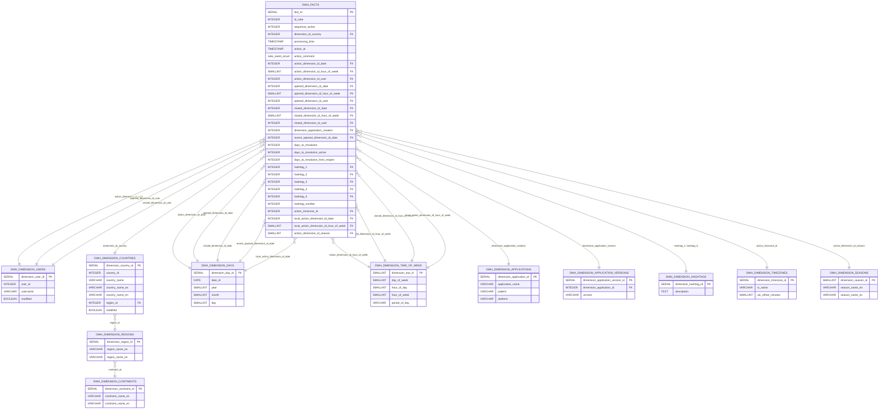

# DWH Star Schema ERD

Version: 2025-08-08

This document shows the entity–relationship diagram (ERD) of the star schema.
The central fact table is `dwh.facts`, connected to its dimensions.

Notes:

- The ERD shows logical relationships aligned with foreign keys defined in
  the SQL DDL. The hashtags relationship is a shorthand for up to five
  optional links to `dimension_hashtags`.
- Cardinalities:
  - Facts to dimensions are many-to-one.
  - Countries to regions are many-to-one.
