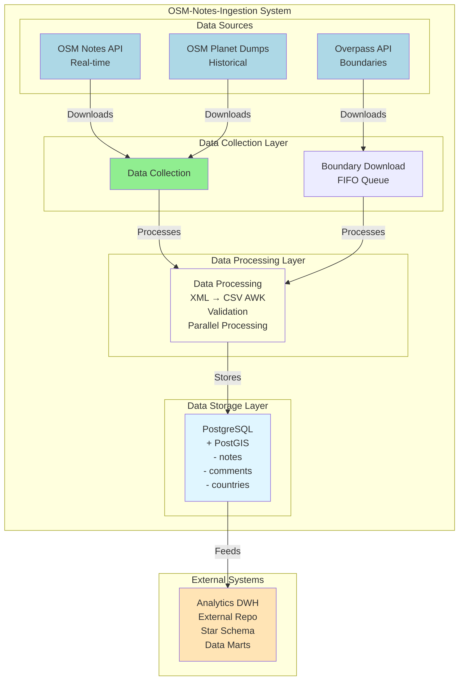

# OSM Notes Ingestion - System Documentation

## Overview

This document provides comprehensive technical documentation for the OSM-Notes-Ingestion system,
including system architecture, data flow, and implementation details.

> **Note:** For project motivation and background, see [Rationale.md](./Rationale.md).

## Log Locations

The system automatically detects installation mode:

- **Installed mode** (production):
  - Logs: `/var/log/osm-notes-ingestion/{daemon,processing,monitoring}/`
  - Lock files: `/var/run/osm-notes-ingestion/`
  - Temporary files: `/var/tmp/osm-notes-ingestion/`

- **Fallback mode** (testing/development):
  - Logs: `/tmp/osm-notes-ingestion/logs/{daemon,processing,monitoring}/`
  - Lock files: `/tmp/osm-notes-ingestion/locks/`
  - Temporary files: `/tmp/`

To find logs automatically (works in both modes):

```bash
# Find latest processAPINotes.log
find /var/log/osm-notes-ingestion/processing /tmp/osm-notes-ingestion/logs/processing \
  -name "processAPINotes.log" -type f -printf '%T@ %p\n' 2>/dev/null | \
  sort -n | tail -1 | awk '{print $2}'
```

See [Installation_Guide.md](./Installation_Guide.md) for installation details.

## Purpose

This repository focuses exclusively on **data ingestion** from OpenStreetMap:

- **Data Collection**: Extracting notes data from OSM API and Planet dumps
- **Data Processing**: Transforming and validating note data
- **Data Storage**: Loading processed data into PostgreSQL/PostGIS

> **Note:** Analytics, ETL, and Data Warehouse components are maintained in a separate repository:
> [OSM-Notes-Analytics](https://github.com/OSM-Notes/OSM-Notes-Analytics)

---

## System Architecture

### Architecture Diagram



### Core Components

The OSM-Notes-Ingestion system consists of the following components:

#### 1. Data Collection Layer

- **API Integration**: Real-time data from OSM Notes API
  - **Daemon Mode (Recommended)**: Continuous polling every 1 minute (30-60 seconds latency)
    - Uses `processAPINotesDaemon.sh` with systemd service
    - Lower latency and better efficiency than manual execution
    - **REQUIRED** for production deployments
  - Limited to last 10,000 closed notes and all open notes
  - Automatic detection of new, modified, and reopened notes

- **Planet Processing**: Historical data from OSM Planet dumps
  - Complete note history since 2013
  - Daily planet dumps processing
  - Full database initialization and updates

- **Geographic Boundaries**: Country and maritime boundaries via Overpass
  - Country polygons for spatial analysis
  - Maritime boundaries
  - Automatic updates

#### 2. Data Processing Layer

- **XML Transformation**: AWK-based extraction from XML to CSV
  - Optimized AWK scripts for API and Planet formats
  - Fast and memory-efficient processing
  - No external XML dependencies
  - Parallel processing support

- **Data Validation**: Comprehensive validation functions
  - XML structure validation (optional)
  - Date and coordinate validation
  - Data integrity checks
  - Schema validation (optional)

- **Parallel Processing**: Partitioned data processing for large volumes
  - Automatic file splitting
  - Parallel AWK extraction
  - Resource management and optimization

#### 3. Data Storage Layer

- **PostgreSQL Database**: Primary data storage
  - Core tables for notes and comments
  - Spatial indexes for geographic queries
  - Temporal indexes for time-based queries

- **PostGIS Extension**: Spatial data handling
  - Geographic coordinates storage
  - Spatial queries and analysis
  - Country assignment for notes

For **WMS (Web Map Service) layer publication**, see the
[OSM-Notes-WMS](https://github.com/OSM-Notes/OSM-Notes-WMS) repository.

For the optional **curated disputed territories** PostGIS table maintained in
this repo (`disputed_territories_wms`), see
[WMS_Disputed_Territories_Layer.md](./WMS_Disputed_Territories_Layer.md).

- **Style Management**: Different styles for open/closed notes
- **Client Integration**: JOSM, Vespucci, and web applications

---

## Data Flow

### Data Flow Diagram

```text
┌─────────────────────────────────────────────────────────────────────┐
│                         Data Flow Overview                           │
└─────────────────────────────────────────────────────────────────────┘

┌──────────────┐
│ Overpass API │
│ (Boundaries) │
└──────┬───────┘
       │
       │ Download (FIFO Queue)
       │
       ▼
┌──────────────┐     ┌──────────────┐
│   Countries  │────▶│   PostGIS    │
│   Table      │     │  Geometry    │
└──────────────┘     └──────────────┘

┌──────────────┐
│ OSM Planet  │
│   Dumps     │
└──────┬───────┘
       │
       │ Download
       │
       ▼
┌──────────────┐     ┌──────────────┐     ┌──────────────┐
│  XML File    │────▶│  AWK Extract │────▶│  CSV Files   │
│  (2.2GB+)    │     │  (Parallel)  │     │  (Partitioned)│
└──────────────┘     └──────────────┘     └──────┬───────┘
                                                  │
                                                  │ Load
                                                  ▼
                                         ┌──────────────┐
                                         │ Sync Tables  │
                                         │ (Temporary)  │
                                         └──────┬───────┘
                                                │
                                                │ Merge
                                                ▼
                                         ┌──────────────┐
                                         │  Base Tables │
                                         │  (notes,     │
                                         │   comments)  │
                                         └──────┬───────┘
                                                │
                                                │ Country
                                                │ Assignment
                                                ▼
                                         ┌──────────────┐
                                         │  Notes with  │
                                         │  Countries   │
                                         └──────┬───────┘
                                                │
                    ┌──────────────────────────┴──────────────────────────┐
                    │
                    ▼
         ┌──────────────────┐
         │  Analytics DWH   │
         │  (External Repo) │
         └──────────────────┘

For **WMS (Web Map Service) layer publication**, see the
[OSM-Notes-WMS](https://github.com/OSM-Notes/OSM-Notes-WMS) repository.

┌──────────────┐
│  OSM Notes   │
│     API      │
└──────┬───────┘
       │
       │ Every 15 min
       │
       ▼
┌──────────────┐     ┌──────────────┐     ┌──────────────┐
│  XML (API)   │────▶│  AWK Extract │────▶│  API Tables  │
│  (<10K notes)│     │  (Parallel)  │     │ (Temporary)  │
└──────────────┘     └──────────────┘     └──────┬───────┘
                                                  │
                                                  │ Update
                                                  ▼
                                         ┌──────────────┐
                                         │  Base Tables │
                                         │  (Incremental│
                                         │   Updates)   │
                                         └──────────────┘
```

### 1. Geographic Data Collection

**Source:** Overpass API queries for country and maritime boundaries

**Process:**

1. Download boundary relations with specific tags
   - FIFO queue system ensures orderly downloads
   - Smart waiting respects Overpass API rate limits
   - Prevents race conditions in parallel processing
   - Thread-safe ticket-based queue management

2. Transform to PostGIS geometry objects
3. Store in `countries` table

**Output:** PostgreSQL geometry objects for spatial queries

### 2. Historical Data Processing (Planet)

**Source:** OSM Planet daily dumps (notes since 2013)

**Process:**

1. Download Planet notes dump
2. Transform XML to CSV using AWK extraction
3. Validate data structure and content (optional)
4. Load into temporary sync tables
5. Merge with main tables

**Output:** Base database with complete note history

**Frequency:** Daily or on-demand

### 3. Incremental Data Synchronization (API)

**Source:** OSM Notes API (recent changes)

**Process:**

1. Query API for updates (last 10,000 closed + all open)
2. Transform XML to CSV
3. Validate and detect changes
4. Load into temporary API tables
5. Update main tables with new/modified notes

**Output:** Updated database with latest changes

**Frequency:**

- **Daemon Mode (Recommended)**: Every 1 minute (30-60 seconds latency)
- **Cron Mode (Alternative)**: Every 15 minutes (legacy option)

### 4. Country Assignment

**Process:**

1. For each new/modified note
2. Perform spatial query against country boundaries
3. Assign country based on geographic location
4. Update note record with country information

**Output:** Notes with assigned countries

### Processing Sequence Diagram

```text
┌─────────────────────────────────────────────────────────────────────┐
│                    Processing Sequence Overview                      │
└─────────────────────────────────────────────────────────────────────┘

API Processing Flow (Daemon: every 1 minute, Cron: every 15 minutes):
┌──────────┐    ┌──────────┐    ┌──────────┐    ┌──────────┐    ┌──────────┐
│  Cron    │───▶│processAPI│───▶│  OSM API │───▶│   AWK    │───▶│PostgreSQL│
│  Scheduler│    │  Script  │    │  (XML)   │    │ Extract  │    │  (API    │
└──────────┘    └────┬─────┘    └──────────┘    └────┬─────┘    │  Tables) │
                     │                               │           └────┬──────┘
                     │                               │                │
                     │                               │                │
                     │                               ▼                │
                     │                      ┌──────────────┐          │
                     │                      │   Parallel   │          │
                     │                      │  Processing  │          │
                     │                      │  (Partitions)│          │
                     │                      └──────────────┘          │
                     │                                                │
                     │                                                ▼
                     │                                      ┌──────────────┐
                     │                                      │  Base Tables │
                     └──────────────────────────────────────▶│  (Updated)  │
                                                             └──────────────┘

Planet Processing Flow (Daily/On-demand):
┌──────────┐    ┌──────────┐    ┌──────────┐    ┌──────────┐    ┌──────────┐
│  Manual  │───▶│processPlan│───▶│  Planet  │───▶│   AWK    │───▶│PostgreSQL│
│  Trigger │    │  etNotes  │    │  Dump    │    │ Extract  │    │  (Sync   │
└──────────┘    └────┬─────┘    └──────────┘    └────┬─────┘    │  Tables) │
                     │                               │           └────┬──────┘
                     │                               │                │
                     │                               ▼                │
                     │                      ┌──────────────┐          │
                     │                      │   Split XML  │          │
                     │                      │   (Parallel)  │          │
                     │                      └──────┬───────┘          │
                     │                               │                 │
                     │                               ▼                 │
                     │                      ┌──────────────┐          │
                     │                      │   Process    │          │
                     │                      │   Parts      │          │
                     │                      │  (Parallel)  │          │
                     │                      └──────┬───────┘          │
                     │                               │                 │
                     │                               ▼                 │
                     │                      ┌──────────────┐          │
                     │                      │  Consolidate │          │
                     │                      │  Partitions  │          │
                     │                      └──────┬───────┘          │
                     │                               │                 │
                     │                               ▼                 │
                     │                                      ┌──────────────┐
                     └──────────────────────────────────────▶│  Base Tables │
                                                             │  (Merged)   │
                                                             └──────────────┘

Country Assignment Flow:
┌──────────┐    ┌──────────┐    ┌──────────┐    ┌──────────┐
│  Notes   │───▶│  Spatial │───▶│ PostGIS  │───▶│  Notes   │
│  (New)   │    │  Query   │    │  (ST_    │    │ (Updated │
│          │    │          │    │ Contains)│    │  w/      │
└──────────┘    └────┬─────┘    └────┬─────┘    │ Country) │
                     │                │         └──────────┘
                     │                │
                     ▼                ▼
              ┌──────────────┐  ┌──────────────┐
              │  Countries   │  │  Parallel    │
              │   Table     │  │  Processing  │
              │  (PostGIS)  │  │  (Chunks)    │
              └──────────────┘  └──────────────┘
```

### Component Interaction Diagram

The following diagram shows how different components interact during processing:

```text
┌─────────────────────────────────────────────────────────────────────────┐
│                    Component Interaction Overview                         │
└─────────────────────────────────────────────────────────────────────────┘

Entry Points
    │
    ├─▶ processAPINotes.sh
    │   │
    │   ├─▶ Loads: bin/lib/functionsProcess.sh
    │   │   ├─▶ Prerequisites checking
    │   │   ├─▶ Base table validation
    │   │   └─▶ Base structure creation
    │   │
    │   ├─▶ Loads: bin/lib/processAPIFunctions.sh
    │   │   ├─▶ API download functions
    │   │   ├─▶ XML counting functions
    │   │   └─▶ API XML processing
    │   │
    │   ├─▶ Loads: bin/lib/parallelProcessingFunctions.sh
    │   │   ├─▶ XML splitting functions
    │   │   ├─▶ Parallel processing coordination
    │   │   └─▶ Partition management
    │   │
    │   ├─▶ Loads: lib/osm-common/validationFunctions.sh
    │   │   ├─▶ XML validation
    │   │   ├─▶ CSV validation
    │   │   └─▶ Enum compatibility checks
    │   │
    │   ├─▶ Loads: lib/osm-common/errorHandlingFunctions.sh
    │   │   ├─▶ Failed marker creation
    │   │   ├─▶ Retry logic
    │   │   └─▶ Circuit breaker pattern
    │   │
    │   ├─▶ Executes: awk/extract_notes.awk
    │   ├─▶ Executes: awk/extract_comments.awk
    │   └─▶ Executes: awk/extract_comment_texts.awk
    │
    ├─▶ processPlanetNotes.sh
    │   │
    │   ├─▶ Loads: bin/lib/processPlanetFunctions.sh
    │   │   ├─▶ Planet file download
    │   │   ├─▶ XML extraction
    │   │   └─▶ Planet-specific processing
    │   │
    │   ├─▶ Loads: bin/lib/parallelProcessingFunctions.sh
    │   │   ├─▶ Binary division of XML
    │   │   ├─▶ Parallel AWK processing
    │   │   └─▶ Partition consolidation
    │   │
    │   ├─▶ Loads: bin/lib/boundaryProcessingFunctions.sh
    │   │   ├─▶ Overpass API queries (FIFO Queue)
    │   │   ├─▶ Semaphore for rate limiting
    │   │   ├─▶ Boundary processing
    │   │   └─▶ Capital validation (prevents cross-contamination)
    │   │
    │   └─▶ Executes: Same AWK scripts as processAPI
    │
    └─▶ updateCountries.sh
        │
        ├─▶ Loads: bin/lib/processPlanetFunctions.sh
        │   └─▶ Geographic data functions
        │
        ├─▶ Loads: bin/lib/boundaryProcessingFunctions.sh
        │   ├─▶ Overpass API queries
        │   ├─▶ Boundary download (FIFO Queue + Semaphore)
        │   └─▶ Capital validation (prevents cross-contamination)
        │
        └─▶ Executes: SQL scripts for country updates

Shared Components
    │
    ├─▶ lib/osm-common/commonFunctions.sh
    │   ├─▶ Logging system (log4j-style)
    │   ├─▶ Common utilities
    │   └─▶ Error handling
    │
    ├─▶ lib/osm-common/validationFunctions.sh
    │   └─▶ Centralized validation
    │
    ├─▶ lib/osm-common/errorHandlingFunctions.sh
    │   └─▶ Centralized error handling
    │
    └─▶ PostgreSQL Database
        ├─▶ Base tables (notes, comments, countries)
        ├─▶ Sync tables (temporary)
        ├─▶ API tables (temporary)
        └─▶ PostGIS functions (spatial operations)
```

### Component Dependencies

The following diagram shows the dependency relationships between components:

```text
┌─────────────────────────────────────────────────────────────────────────┐
│                    Component Dependency Overview                          │
└─────────────────────────────────────────────────────────────────────────┘

Entry Points
    │
    ├─▶ processAPINotes.sh
    │   └─▶ Depends on:
    │       ├─▶ bin/lib/processAPIFunctions.sh
    │       ├─▶ bin/lib/parallelProcessingFunctions.sh
    │       ├─▶ bin/lib/functionsProcess.sh
    │       └─▶ lib/osm-common/*.sh (all common libraries)
    │
    ├─▶ processPlanetNotes.sh
    │   └─▶ Depends on:
    │       ├─▶ bin/lib/processPlanetFunctions.sh
    │       ├─▶ bin/lib/noteProcessingFunctions.sh
    │       ├─▶ bin/lib/boundaryProcessingFunctions.sh
    │       ├─▶ bin/lib/parallelProcessingFunctions.sh
    │       └─▶ lib/osm-common/*.sh (all common libraries)
    │
    └─▶ updateCountries.sh
        └─▶ Depends on:
            ├─▶ bin/lib/boundaryProcessingFunctions.sh
            ├─▶ bin/lib/processPlanetFunctions.sh
            └─▶ lib/osm-common/*.sh (all common libraries)

Core Libraries (bin/lib/)
    │
    ├─▶ functionsProcess.sh (main entry point)
    │   └─▶ Loads:
    │       ├─▶ lib/osm-common/commonFunctions.sh
    │       ├─▶ lib/osm-common/validationFunctions.sh
    │       ├─▶ lib/osm-common/errorHandlingFunctions.sh
    │       ├─▶ bin/lib/securityFunctions.sh
    │       └─▶ bin/lib/overpassFunctions.sh
    │
    ├─▶ processAPIFunctions.sh
    │   └─▶ Depends on: functionsProcess.sh
    │
    ├─▶ processPlanetFunctions.sh
    │   └─▶ Depends on: functionsProcess.sh
    │
    ├─▶ noteProcessingFunctions.sh
    │   └─▶ Depends on: functionsProcess.sh
    │
    ├─▶ boundaryProcessingFunctions.sh
    │   ├─▶ Depends on: functionsProcess.sh
    │   └─▶ Depends on: overpassFunctions.sh
    │
    └─▶ parallelProcessingFunctions.sh
        └─▶ Depends on: lib/osm-common/commonFunctions.sh

Shared Libraries (lib/osm-common/)
    │
    ├─▶ commonFunctions.sh (base library)
    │   └─▶ Provides: Logging, error codes, prerequisites
    │
    ├─▶ validationFunctions.sh
    │   └─▶ Depends on: commonFunctions.sh
    │
    ├─▶ errorHandlingFunctions.sh
    │   └─▶ Depends on: commonFunctions.sh
    │
    └─▶ alertFunctions.sh
        └─▶ Depends on: commonFunctions.sh

External Dependencies
    │
    ├─▶ PostgreSQL/PostGIS (database)
    ├─▶ OSM API (data source)
    ├─▶ OSM Planet (data source)
    ├─▶ Overpass API (boundaries)
    ├─▶ GNU Parallel (parallel processing)
    ├─▶ AWK (XML processing)
    └─▶ ogr2ogr/GDAL (GeoJSON processing)
```

> **Note:** For detailed dependency information, see
> [Component_Dependencies.md](./Component_Dependencies.md).

### Error Handling Flow

The following diagram shows the error handling and recovery mechanism:

```text
┌─────────────────────────────────────────────────────────────────────────┐
│                    Error Handling Flow                                   │
└─────────────────────────────────────────────────────────────────────────┘

Execution
    │
    ├─▶ Error occurs
    │   │
    │   ├─▶ ERR trap triggered
    │   │   ├─▶ Capture error context
    │   │   │   ├─▶ Line number
    │   │   │   ├─▶ Command that failed
    │   │   │   └─▶ Exit code
    │   │   │
    │   │   ├─▶ Log error details
    │   │   │
    │   │   └─▶ Check GENERATE_FAILED_FILE
    │   │       │
    │   │       ├─▶ If true:
    │   │       │   ├─▶ Create failed marker file
    │   │       │   │   └─▶ /tmp/SCRIPT_NAME_failed_execution
    │   │       │   │
    │   │       │   ├─▶ Send email alert
    │   │       │   │   └─▶ If SEND_ALERT_EMAIL=true
    │   │       │   │
    │   │       │   └─▶ Exit with error code
    │   │       │
    │   │       └─▶ If false:
    │   │           └─▶ Exit with error code (no marker)
    │   │
    │   └─▶ EXIT trap triggered
```

### Error Handling Sequence Diagram

The following diagram shows the detailed sequence of error handling interactions:

```text
┌─────────────────────────────────────────────────────────────────────────┐
│          Error Handling: Detailed Component Interactions                │
└─────────────────────────────────────────────────────────────────────────┘

Script Execution    ERR Trap    Error Handler    Logger    Email System    File System
    │                  │              │            │            │              │
    │───command fails──▶│              │            │            │              │
    │                  │              │            │            │              │
    │                  │───capture error───────────▶│            │            │
    │                  │              │            │            │              │
    │                  │              │───get context───────────▶│            │
    │                  │              │◀───line, cmd, code────────│            │
    │                  │              │            │            │              │
    │                  │              │───log error───────────────▶│            │
    │                  │              │            │            │              │
    │                  │              │            │───write log───────────────▶│
    │                  │              │            │◀───logged───────────────────│
    │                  │              │◀───logged──────────────────│            │
    │                  │              │            │            │              │
    │                  │───check GENERATE_FAILED_FILE───────────▶│            │
    │                  │              │            │            │              │
    │                  │              │───if true: create marker───────────────▶│
    │                  │              │            │            │              │
    │                  │              │            │            │───create file──▶│
    │                  │              │            │            │◀───file created─│
    │                  │              │◀───marker created───────────────────────│
    │                  │              │            │            │              │
    │                  │              │───if SEND_ALERT_EMAIL: send──────────────▶│
    │                  │              │            │            │              │
    │                  │              │            │            │───send email───▶│
    │                  │              │            │            │◀───sent────────│
    │                  │              │◀───alert sent───────────────────────────│
    │                  │              │            │            │              │
    │                  │───exit with error code───▶│            │            │
    │                  │              │            │            │              │
    │◀───execution stopped─────────────│              │            │            │
```

### Validation Flow Diagram

The following diagram shows the validation process flow:

```text
┌─────────────────────────────────────────────────────────────────────────┐
│                    Validation Flow Sequence                              │
└─────────────────────────────────────────────────────────────────────────┘

Script    Validation Functions    XML Validator    CSV Validator    Database    Logger
  │              │                      │                │             │          │
  │───start──────▶│                      │                │             │          │
  │              │                      │                │             │          │
  │              │───check SKIP_XML_VALIDATION───────────▶│             │          │
  │              │                      │                │             │          │
  │              │   [If false: validate XML]            │             │          │
  │              │                      │                │             │          │
  │              │───validate XML structure──────────────▶│             │          │
  │              │                      │                │             │          │
  │              │                      │───check XSD────▶│             │          │
  │              │                      │◀───valid/invalid│             │          │
  │              │◀───XML validation result───────────────│             │          │
  │              │                      │                │             │          │
  │              │───log result──────────────────────────────────────────▶│
  │              │                      │                │             │          │
  │              │───check SKIP_CSV_VALIDATION───────────▶│             │          │
  │              │                      │                │             │          │
  │              │   [If false: validate CSV]             │             │          │
  │              │                      │                │             │          │
  │              │───validate CSV structure───────────────▶│             │          │
  │              │                      │                │             │          │
  │              │                      │───check columns───────────────▶│
  │              │                      │                │◀───valid/invalid│          │
  │              │                      │◀───CSV validation result───────│          │
  │              │◀───CSV validation result───────────────│             │          │
  │              │                      │                │             │          │
  │              │───validate enum compatibility──────────▶│             │          │
  │              │                      │                │             │          │
  │              │                      │───check enums───────────────────▶│
  │              │                      │                │◀───compatible/incompatible│
  │              │◀───enum validation result───────────────│             │          │
  │              │                      │                │             │          │
  │              │───log all results──────────────────────────────────────▶│
  │              │                      │                │             │          │
  │◀───validation complete──────────────│                      │                │             │          │
```

    │       ├─▶ Cleanup temporary files
    │       ├─▶ Remove lock file
    │       └─▶ Exit
    │
    └─▶ Next execution
        │
        ├─▶ Check failed marker
        │   ├─▶ If exists:
        │   │   ├─▶ Display error message
        │   │   ├─▶ Show marker file location
        │   │   └─▶ Exit (prevent execution)
        │   │
        │   └─▶ If not exists:
        │       └─▶ Continue normal execution
        │
        └─▶ Recovery (manual)
            ├─▶ Admin reviews email alert
            ├─▶ Admin checks logs
            ├─▶ Admin fixes issue
            ├─▶ Admin removes marker file
            └─▶ Wait for next cron execution

````

For **WMS (Web Map Service) layer publication**, see the
[OSM-Notes-WMS](https://github.com/OSM-Notes/OSM-Notes-WMS) repository.

---

## Usage Examples

This section provides real, verified code examples based on the actual implementation. All examples reflect the current codebase behavior.

### Basic Script Execution

#### Processing API Notes (Incremental Sync)

The `processAPINotes.sh` script does not accept command-line arguments (except `--help`). Configuration is done via environment variables:

```bash
# Basic execution (production mode)
./bin/process/processAPINotes.sh

# With debug logging
export LOG_LEVEL=DEBUG
./bin/process/processAPINotes.sh

# Enable XML validation (default is to skip for speed)
export SKIP_XML_VALIDATION=false
export SKIP_CSV_VALIDATION=false
./bin/process/processAPINotes.sh

# Keep temporary files for debugging
export CLEAN=false
export LOG_LEVEL=DEBUG
./bin/process/processAPINotes.sh

# Enable bash debug mode (shows all commands)
export BASH_DEBUG=true
export LOG_LEVEL=TRACE
./bin/process/processAPINotes.sh
````

**Note:** The script creates temporary directories and logs. Location depends on installation mode:

- **Installed**: Logs in `/var/log/osm-notes-ingestion/processing/processAPINotes.log`
- **Fallback**: Logs in `/tmp/osm-notes-ingestion/logs/processing/processAPINotes.log`

**Following progress:**

```bash
# Find and tail latest log (works in both modes)
LATEST_LOG=$(find /var/log/osm-notes-ingestion/processing /tmp/osm-notes-ingestion/logs/processing \
  -name "processAPINotes.log" -type f -printf '%T@ %p\n' 2>/dev/null | \
  sort -n | tail -1 | awk '{print $2}')
if [[ -n "${LATEST_LOG}" ]] && [[ -f "${LATEST_LOG}" ]]; then
  tail -40f "${LATEST_LOG}"
fi
```

#### Processing Planet Notes (Historical Data)

The `processPlanetNotes.sh` script accepts a `--base` parameter for full initialization:

> **Operations:** Long base loads can take hours. See
> [Base_Load_Progress_Monitoring.md](./Base_Load_Progress_Monitoring.md) for log
> locations, SQL snapshots (notes/comments/countries/assignment), and the
> `base_load_complete` property.

```bash
# Sync mode (incremental update from Planet)
./bin/process/processPlanetNotes.sh

# Base mode (full initialization, drops and recreates tables)
./bin/process/processPlanetNotes.sh --base

# With validation enabled
export SKIP_XML_VALIDATION=false
export LOG_LEVEL=INFO
./bin/process/processPlanetNotes.sh --base

# Debug mode with file preservation
export LOG_LEVEL=DEBUG
export CLEAN=false
./bin/process/processPlanetNotes.sh --base
```

#### Updating Country Boundaries

The `updateCountries.sh` script updates geographic boundaries using a safe update strategy:

```bash
# Update mode (normal operation - uses safe update strategy)
./bin/process/updateCountries.sh

# Base mode (recreate country tables - uses safe update strategy)
./bin/process/updateCountries.sh --base

# With debug logging
export LOG_LEVEL=DEBUG
./bin/process/updateCountries.sh

# Force swap even if validation raises warnings (use with caution)
export FORCE_SWAP_ON_WARNING=true
./bin/process/updateCountries.sh
```

**Safe Update Strategy:**

- Creates `countries_new` table (doesn't drop `countries`)
- Loads new data into `countries_new`
- Compares geometries between `countries` and `countries_new`
- Swaps tables only if validation passes
- Keeps `countries_old` as automatic backup

> **Note:** The script includes capital validation to prevent data cross-contamination. See
> [Capital_Validation_Explanation.md](./Capital_Validation_Explanation.md) for details on how
> boundary validation works. See
> [Countries_Table_Update_Strategy.md](./Countries_Table_Update_Strategy.md) for details on the safe
> update strategy.

### Environment Variables

All scripts support common environment variables. See
[bin/ENVIRONMENT_VARIABLES.md](../bin/Environment_Variables.md) for complete documentation.

#### Common Variables

```bash
# Logging level (TRACE, DEBUG, INFO, WARN, ERROR, FATAL)
export LOG_LEVEL=DEBUG

# Cleanup temporary files (true/false, default: true)
export CLEAN=true

# Skip XML validation (true/false, default: true - skips validation)
export SKIP_XML_VALIDATION=false  # Set to false to enable validation

# Skip CSV validation (true/false, default: true - skips validation)
export SKIP_CSV_VALIDATION=false  # Set to false to enable validation

# Database name override
export DBNAME=osm_notes_test

# Bash debug mode (shows all commands)
export BASH_DEBUG=true
```

#### processAPINotes.sh Specific Variables

```bash
# Email alerts configuration
export ADMIN_EMAIL="admin@example.com"
export SEND_ALERT_EMAIL=true

# Complete example with all options
export LOG_LEVEL=DEBUG
export CLEAN=false
export SKIP_XML_VALIDATION=false
export ADMIN_EMAIL="admin@example.com"
export SEND_ALERT_EMAIL=true
./bin/process/processAPINotes.sh
```

### Error Handling and Recovery

#### Failed Execution Marker

When critical errors occur, the script creates a failed execution marker file:

```bash
# Check if previous execution failed
# Find failed execution marker (works in both modes)
FAILED_FILE=$(find /var/run/osm-notes-ingestion /tmp/osm-notes-ingestion/locks \
  -name "processAPINotes_failed_execution" 2>/dev/null | head -1)
if [[ -n "${FAILED_FILE}" ]]; then
  ls -la "${FAILED_FILE}"
fi

# Recover from failed execution
# 1. Check email for alert details
# 2. Fix the underlying issue (database, network, etc.)
# 3. Remove the marker file
# Remove failed execution marker (works in both modes)
FAILED_FILE=$(find /var/run/osm-notes-ingestion /tmp/osm-notes-ingestion/locks \
  -name "processAPINotes_failed_execution" 2>/dev/null | head -1)
if [[ -n "${FAILED_FILE}" ]]; then
  rm "${FAILED_FILE}"
fi

# 4. Wait for next execution
# If using daemon mode: it will retry automatically
# If using cron mode: wait for the next scheduled execution
# (e.g., every 15 minutes for processAPINotes.sh)

# Note: Manual execution is only for testing/debugging.
# In production, let the daemon or cron job handle the next execution.
```

#### Lock File Management

Scripts use lock files to prevent concurrent execution:

```bash
# Check if script is running
# Find and display lock file (works in both modes)
LOCK_FILE=$(find /var/run/osm-notes-ingestion /tmp/osm-notes-ingestion/locks \
  -name "processAPINotes.lock" 2>/dev/null | head -1)
if [[ -n "${LOCK_FILE}" ]]; then
  ls -la "${LOCK_FILE}"
fi

# View lock file contents (shows PID and start time)
# Find and display lock file (works in both modes)
LOCK_FILE=$(find /var/run/osm-notes-ingestion /tmp/osm-notes-ingestion/locks \
  -name "processAPINotes.lock" 2>/dev/null | head -1)
if [[ -n "${LOCK_FILE}" ]]; then
  cat "${LOCK_FILE}"
fi

# Remove stale lock (only if process is not running!)
# First verify: ps aux | grep processAPINotes.sh
# Remove lock file (works in both modes)
LOCK_FILE=$(find /var/run/osm-notes-ingestion /tmp/osm-notes-ingestion/locks \
  -name "processAPINotes.lock" 2>/dev/null | head -1)
if [[ -n "${LOCK_FILE}" ]]; then
  rm "${LOCK_FILE}"
fi
```

### Monitoring and Logging

#### Viewing Logs

```bash
# Find latest log directory
# Find latest log (works in both modes)
LATEST_LOG=$(find /var/log/osm-notes-ingestion/processing /tmp/osm-notes-ingestion/logs/processing \
  -name "processAPINotes.log" -type f -printf '%T@ %p\n' 2>/dev/null | \
  sort -n | tail -1 | awk '{print $2}')
LATEST_DIR=$(dirname "${LATEST_LOG}" 2>/dev/null || echo "")
echo "Log directory: $LATEST_DIR"

# View log file (works in both modes)
if [[ -n "${LATEST_LOG}" ]] && [[ -f "${LATEST_LOG}" ]]; then
  tail -f "${LATEST_LOG}"
  grep -i error "${LATEST_LOG}"
  grep -i warn "${LATEST_LOG}"
fi
```

#### Database Monitoring

```bash
# Check PostgreSQL application name (shows which script is using DB)
psql -d notes -c "SELECT application_name, state, query_start FROM pg_stat_activity WHERE application_name LIKE 'process%';"

# Monitor active connections
psql -d notes -c "SELECT count(*) FROM pg_stat_activity WHERE datname = 'notes';"
```

### Automated Execution Configuration

#### Required: Daemon Mode (systemd)

For production use, the daemon mode is **REQUIRED**. The main API notes processing runs as a systemd
service (daemon), not via cron. See `docs/Process_API.md` "Daemon Mode" section for detailed
installation and configuration instructions.

The daemon (`processAPINotesDaemon.sh`) handles:

- Continuous API notes ingestion (polls every minute)
- Automatic initial setup (creates tables, loads historical data, loads countries)
- Automatic Planet synchronization when needed (10K notes + new dump)

#### Maintenance and Monitoring Tasks (Cron)

While the main API notes processing runs as a daemon, you need to configure cron for maintenance and
monitoring tasks:

```bash
# Country boundaries update: Monthly (first day at 2 AM)
0 2 1 * * cd /path/to/OSM-Notes-Ingestion && ./bin/process/updateCountries.sh >/dev/null 2>&1

# Data verification and correction: Daily check and correction (6 AM)
# Corrects problems from API calls and identifies hidden notes (only detectable with Planet)
# Note: It's normal for this script to do nothing if tables are already correct.
0 6 * * * cd /path/to/OSM-Notes-Ingestion && EMAILS="your-email@example.com" ./bin/monitor/notesCheckVerifier.sh >/dev/null 2>&1

# Database performance analysis: Monthly (first day at 3 AM)
# Create logs directory first: mkdir -p ~/logs
0 3 1 * * cd /path/to/OSM-Notes-Ingestion && ./bin/monitor/analyzeDatabasePerformance.sh --db notes > ~/logs/db_performance_monthly_$(date +\%Y\%m\%d).log 2>&1
```

**Important Notes:**

- Do NOT add `processAPINotes.sh` to cron - it is handled by the daemon
- Do NOT add `processPlanetNotes.sh` to cron - it is automatically called by the daemon when needed
- Cron is only for maintenance (country updates) and monitoring (verification, performance analysis)
- Scripts automatically create log files in `/tmp/SCRIPT_NAME_XXXXXX/SCRIPT_NAME.log`
- For production, consider redirecting logs to a persistent directory (e.g., `~/logs/` or `./logs/`)

See `examples/crontab-setup.example` for detailed cron configuration examples.

### Testing and Development

#### Development Mode

```bash
# Use test database
export DBNAME=osm_notes_test

# Enable all logging
export LOG_LEVEL=TRACE

# Keep files for inspection
export CLEAN=false

# Enable strict validation
export SKIP_XML_VALIDATION=false
export SKIP_CSV_VALIDATION=false

# Run script
./bin/process/processAPINotes.sh
```

#### Production Mode

```bash
# Use production database (default)
# DBNAME comes from etc/properties.sh (created from etc/properties.sh.example)

# Minimal logging
export LOG_LEVEL=ERROR

# Clean up files (default: true)
export CLEAN=true

# Skip validation for speed (defaults already skip both XML and CSV validation)
# SKIP_XML_VALIDATION=true is the default, no need to export
# SKIP_CSV_VALIDATION=true is the default, no need to export
# Both validations are skipped by default for faster processing

# Enable alerts
export SEND_ALERT_EMAIL=true
export ADMIN_EMAIL="admin@production.com"

# Run script
./bin/process/processAPINotes.sh
```

### Help and Documentation

All scripts support `--help` or `-h`:

```bash
# Get help for any script
./bin/process/processAPINotes.sh --help
./bin/process/processPlanetNotes.sh --help
./bin/process/updateCountries.sh --help
```

---

## Common Use Cases

This section describes real-world scenarios and typical workflows for using the OSM-Notes-Ingestion
system.

### Use Case 1: Initial System Setup

**Scenario**: Setting up a new OSM-Notes-Ingestion system from scratch.

**Workflow**:

```bash
# Step 1: Clone repository with submodules
git clone --recurse-submodules https://github.com/OSM-Notes/OSM-Notes-Ingestion.git
cd OSM-Notes-Ingestion

# Step 2: Configure database connection and User-Agent
# Create etc/properties.sh from the example file
cp etc/properties.sh.example etc/properties.sh
# Edit etc/properties.sh with your database credentials and email
vi etc/properties.sh
# Important: Replace 'your-email@domain.com' in DOWNLOAD_USER_AGENT
# with your actual email address (OpenStreetMap best practice)

# Step 3: Create database and extensions
createdb notes
psql -d notes -c "CREATE EXTENSION IF NOT EXISTS postgis;"

# Step 3.5: Install directories (optional, for production)
# For development/testing, you can skip this step - the system will
# automatically use fallback mode (/tmp directories)
# For production, install directories for persistent logs:
sudo bin/scripts/install_directories.sh
# Or with custom user/group:
# sudo OSM_USER=your_user OSM_GROUP=your_group bin/scripts/install_directories.sh
# See docs/LOCAL_SETUP.md for details

# Step 4: Load historical data from Planet (takes 1-2 hours)
./bin/process/processPlanetNotes.sh --base

# Step 5: Load country and maritime boundaries
./bin/process/updateCountries.sh --base

# Step 6: Generate backups for faster future processing
./bin/scripts/generateNoteLocationBackup.sh
./bin/scripts/exportCountriesBackup.sh
./bin/scripts/exportMaritimesBackup.sh


# Step 8: Set up automated processing
# Recommended: Daemon mode (systemd)
sudo cp examples/systemd/osm-notes-ingestion-daemon.service /etc/systemd/system/
sudo systemctl daemon-reload
sudo systemctl enable osm-notes-ingestion-daemon
sudo systemctl start osm-notes-ingestion-daemon

# Alternative: Cron mode (if systemd not available)
# crontab -e
# Add: */15 * * * * cd /path/to/OSM-Notes-Ingestion && ./bin/process/processAPINotes.sh
```

**Expected Duration**: 2-3 hours (mostly Planet processing)

**Verification**:

```bash
# Check notes count
psql -d notes -c "SELECT COUNT(*) FROM notes;"

# Check countries loaded
psql -d notes -c "SELECT COUNT(*) FROM countries;"
```

### Use Case 2: Production Deployment

**Scenario**: Deploying the system in a production environment with monitoring and alerting.

**Workflow**:

```bash
# Step 1: Production database setup
# Use a dedicated PostgreSQL instance with proper backups
createdb -E UTF8 notes
psql -d notes -c "CREATE EXTENSION IF NOT EXISTS postgis;"

# Step 1.5: Install directories for persistent logs (required for production)
# This creates /var/log/osm-notes-ingestion/, /var/tmp/osm-notes-ingestion/,
# and /var/run/osm-notes-ingestion/ with proper permissions and logrotate
sudo bin/scripts/install_directories.sh
# Or with custom user/group:
# sudo OSM_USER=notes OSM_GROUP=maptimebogota bin/scripts/install_directories.sh
# See docs/LOCAL_SETUP.md for details

# Step 2: Configure production settings
export DBNAME=notes
export ADMIN_EMAIL="admin@yourdomain.com"
export SEND_ALERT_EMAIL=true
export LOG_LEVEL=WARN  # Reduce log verbosity in production

# Step 3: Initial data load (run during maintenance window)
./bin/process/processPlanetNotes.sh --base
./bin/process/updateCountries.sh --base

# Step 4: Set up cron jobs
crontab -e
# Add:
# */15 * * * * cd /opt/osm-notes && ./bin/process/processAPINotes.sh
# 0 2 * * * cd /opt/osm-notes && ./bin/process/processPlanetNotes.sh
# 0 3 * * 0 cd /opt/osm-notes && ./bin/process/updateCountries.sh
# 0 4 * * * cd /opt/osm-notes && ./bin/monitor/notesCheckVerifier.sh

# Step 5: Set up log rotation
# Configure logrotate for logs (works in both modes)
# Installed mode: /var/log/osm-notes-ingestion/
# Fallback mode: /tmp/osm-notes-ingestion/logs/
# Or redirect logs to ~/logs/ (user-writable path)

# Step 6: Monitor system health
# Set up monitoring for:
# - Database size and performance
# - Script execution status
# - Failed execution markers
# - Disk space
```

**Monitoring Setup**:

```bash
# Daily health check script
cat > /usr/local/bin/check-osm-notes-health.sh << 'EOF'
#!/bin/bash
# Check for failed executions
# Find failed execution marker (works in both modes)
FAILED_FILE=$(find /var/run/osm-notes-ingestion /tmp/osm-notes-ingestion/locks \
  -name "processAPINotes_failed_execution" 2>/dev/null | head -1)
if [[ -n "${FAILED_FILE}" ]] && [[ -f "${FAILED_FILE}" ]]; then
    echo "ALERT: processAPINotes failed"
    cat /tmp/processAPINotes_failed_execution | mail -s "OSM Notes Alert" admin@yourdomain.com
fi

# Check database size
DB_SIZE=$(psql -d notes -t -c "SELECT pg_size_pretty(pg_database_size('notes'));")
echo "Database size: $DB_SIZE"

# Check note count
NOTE_COUNT=$(psql -d notes -t -c "SELECT COUNT(*) FROM notes;")
echo "Total notes: $NOTE_COUNT"
EOF

chmod +x /usr/local/bin/check-osm-notes-health.sh

# Add to crontab (daily at 6 AM)
# 0 6 * * * /usr/local/bin/check-osm-notes-health.sh
```

### Use Case 3: Integration with Analytics System

**Scenario**: Integrating OSM-Notes-Ingestion with
[OSM-Notes-Analytics](https://github.com/OSM-Notes/OSM-Notes-Analytics) for data warehouse and
analytics.

**Workflow**:

```bash
# Step 1: Ensure OSM-Notes-Ingestion is running and syncing
# Verify data is being updated
psql -d notes -c "SELECT MAX(created_at) FROM notes;"

# Step 2: Verify data flow
# Check that analytics tables are being populated
# Query analytics database for latest data
```

**Data Flow**:

```text
OSM API → processAPINotes.sh → PostgreSQL (notes)
                                           │
                                           ▼
                              ETL Process (OSM-Notes-Analytics)
                                           │
                                           ▼
                              Data Warehouse → Data Marts
```

**Verification**:

```bash
# Check ingestion is working
psql -d notes -c "SELECT COUNT(*) FROM notes WHERE created_at > NOW() - INTERVAL '1 hour';"

# Check analytics data (if Analytics project is deployed)
# See [OSM-Notes-Analytics](https://github.com/OSM-Notes/OSM-Notes-Analytics) for details
```

For **WMS (Web Map Service) layer publication**, see the
[OSM-Notes-WMS](https://github.com/OSM-Notes/OSM-Notes-WMS) repository.

### Use Case 4: Data Quality Monitoring

**Scenario**: Monitoring data quality and detecting synchronization issues.

> **Note:** For comprehensive system monitoring across all repositories, see
> [OSM-Notes-Monitoring](https://github.com/OSM-Notes/OSM-Notes-Monitoring). This use case describes
> local monitoring scripts specific to ingestion.

**Workflow**:

```bash
# Step 1: Set up daily verification
crontab -e
# Add: 0 4 * * * cd /path/to/OSM-Notes-Ingestion && ./bin/monitor/notesCheckVerifier.sh

# Step 2: Set up database performance monitoring
crontab -e
# Add: 0 2 * * * cd /path/to/OSM-Notes-Ingestion && ./bin/monitor/analyzeDatabasePerformance.sh

# Step 3: Review verification results
# Check logs for discrepancies
# Find latest notesCheckVerifier log (works in both modes)
LATEST_LOG=$(find /var/log/osm-notes-ingestion/monitoring /tmp/osm-notes-ingestion/logs/monitoring \
  -name "notesCheckVerifier.log" -type f -printf '%T@ %p\n' 2>/dev/null | \
  sort -n | tail -1 | awk '{print $2}')
if [[ -n "${LATEST_LOG}" ]] && [[ -f "${LATEST_LOG}" ]]; then
  cat "${LATEST_LOG}"
fi

# Step 4: Investigate discrepancies
# If issues found, review:
# - API processing logs
# - Planet processing logs
# - Database state
```

**Automated Alerts**:

```bash
# Configure email alerts for verification failures
export ADMIN_EMAIL="admin@yourdomain.com"
export SEND_ALERT_EMAIL=true

# The verification script will send alerts if discrepancies are found
```

### Use Case 6: Development and Testing

**Scenario**: Setting up a development environment for testing changes.

**Workflow**:

```bash
# Step 1: Create test database
createdb osm_notes_ingestion_test
psql -d osm_notes_ingestion_test -c "CREATE EXTENSION IF NOT EXISTS postgis;"

# Step 2: Use test database for all operations
export DBNAME=osm_notes_ingestion_test

# Step 3: Load minimal test data
# Use mock data or small subset of real data
./bin/process/processPlanetNotes.sh --base

# Step 4: Run with debug logging
export LOG_LEVEL=DEBUG
export CLEAN=false  # Keep files for inspection

# Step 5: Run tests
./tests/run_all_tests.sh

# Step 6: Test specific changes
./bin/process/processAPINotes.sh
# Inspect generated files in temporary directories (works in both modes)
# Installed: /var/tmp/osm-notes-ingestion/processAPINotes_*/
# Fallback: /tmp/processAPINotes_*/
```

**Testing Workflow**:

```bash
# 1. Make changes to code
# 2. Run unit tests
./tests/run_tests_simple.sh

# 3. Run integration tests
./tests/run_integration_tests.sh

# 4. Test with real data (small subset)
export DBNAME=osm_notes_ingestion_test
./bin/process/processAPINotes.sh

# 5. Verify results
psql -d osm_notes_ingestion_test -c "SELECT COUNT(*) FROM notes;"
```

### Use Case 7: Disaster Recovery

**Scenario**: Recovering from database corruption or data loss.

**Workflow**:

```bash
# Step 1: Assess damage
psql -d notes -c "SELECT COUNT(*) FROM notes;"
psql -d notes -c "SELECT COUNT(*) FROM countries;"

# Step 2: Backup current state (if possible)
pg_dump notes > backup_before_recovery.sql

# Step 3: Restore from Planet (full reload)
./bin/process/processPlanetNotes.sh --base

# Step 4: Reload boundaries
./bin/process/updateCountries.sh --base

# Step 5: Regenerate backups
./bin/scripts/generateNoteLocationBackup.sh
./bin/scripts/exportCountriesBackup.sh
./bin/scripts/exportMaritimesBackup.sh

# Step 6: Verify recovery
psql -d notes -c "SELECT COUNT(*) FROM notes;"
psql -d notes -c "SELECT MAX(created_at) FROM notes;"

# Step 7: Resume normal operations
# API processing will catch up with recent notes
```

**Prevention**:

```bash
# Set up regular backups
# Daily database backup
0 1 * * * pg_dump notes | gzip > /backups/osm_notes_$(date +\%Y\%m\%d).sql.gz

# Weekly full backup including boundaries
0 2 * * 0 ./bin/scripts/exportCountriesBackup.sh && ./bin/scripts/exportMaritimesBackup.sh
```

### Use Case 8: Performance Optimization

**Scenario**: Optimizing system performance for large datasets.

**Workflow**:

```bash
# Step 1: Analyze current performance
./bin/monitor/analyzeDatabasePerformance.sh

# Step 2: Review query performance
psql -d notes -c "EXPLAIN ANALYZE SELECT COUNT(*) FROM notes WHERE id_country = 1;"

# Step 3: Optimize database
psql -d notes -c "ANALYZE;"
psql -d notes -c "VACUUM FULL notes;"

# Step 4: Adjust parallel processing
# If memory is constrained, reduce MAX_THREADS
export MAX_THREADS=4  # Default is CPU cores - 2

# Step 5: Monitor improvements
# Track processing times
# Find latest log and grep (works in both modes)
LATEST_LOG=$(find /var/log/osm-notes-ingestion/processing /tmp/osm-notes-ingestion/logs/processing \
  -name "processAPINotes.log" -type f -printf '%T@ %p\n' 2>/dev/null | \
  sort -n | tail -1 | awk '{print $2}')
if [[ -n "${LATEST_LOG}" ]] && [[ -f "${LATEST_LOG}" ]]; then
  grep "Processing time" "${LATEST_LOG}"
fi
```

**Performance Tuning**:

```bash
# For large datasets, consider:
# 1. Increase database shared_buffers
# 2. Add more indexes for common queries
# 3. Partition large tables
# 4. Adjust PostgreSQL configuration
# 5. Use faster storage (SSD) for database
```

### Use Case 9: Multi-Server Deployment

**Scenario**: Deploying across multiple servers (ingestion, database).

**Architecture**:

```text
Server 1 (Ingestion):
  - processAPINotesDaemon.sh (systemd service - REQUIRED)
  - processPlanetNotes.sh (automatic, called by daemon when needed)
  - updateCountries.sh (scheduled via cron - monthly)

Server 2 (Database):
  - PostgreSQL/PostGIS
  - Database backups

```

**Note**: For WMS service deployment, see the
[OSM-Notes-WMS](https://github.com/OSM-Notes/OSM-Notes-WMS) repository.

**Configuration**:

```bash
# On ingestion server, configure remote database
# Create etc/properties.sh from the example file (if not already created)
cp etc/properties.sh.example etc/properties.sh
# Edit etc/properties.sh:
DB_HOST=db-server.example.com
DB_PORT=5432
DBNAME=notes
DB_USER=osm_user
DB_PASSWORD=secure_password
```

**Network Considerations**:

- Ensure low latency between ingestion and database servers
- Use dedicated network for database connections
- Configure firewall rules appropriately
- Monitor network performance

### Use Case 10: Integration with External Monitoring

**Scenario**: Integrating with external monitoring systems (Nagios, Prometheus, etc.).

> **Note:** For centralized monitoring across all OSM Notes repositories, see
> [OSM-Notes-Monitoring](https://github.com/OSM-Notes/OSM-Notes-Monitoring). This use case describes
> integration with external monitoring systems for this repository.

**Workflow**:

```bash
# Step 1: Create monitoring script
cat > /usr/local/bin/check-osm-notes.sh << 'EOF'
#!/bin/bash
# Exit codes: 0=OK, 1=WARNING, 2=CRITICAL

# Check for failed executions
# Find failed execution marker (works in both modes)
FAILED_FILE=$(find /var/run/osm-notes-ingestion /tmp/osm-notes-ingestion/locks \
  -name "processAPINotes_failed_execution" 2>/dev/null | head -1)
if [[ -n "${FAILED_FILE}" ]] && [[ -f "${FAILED_FILE}" ]]; then
    echo "CRITICAL: processAPINotes failed"
    exit 2
fi

# Check database connectivity
if ! psql -d notes -c "SELECT 1;" > /dev/null 2>&1; then
    echo "CRITICAL: Database connection failed"
    exit 2
fi

# Check data freshness (notes updated in last hour)
LAST_UPDATE=$(psql -d notes -t -c "SELECT MAX(created_at) FROM notes;")
if [ -z "$LAST_UPDATE" ]; then
    echo "WARNING: No notes found"
    exit 1
fi

echo "OK: System operational"
exit 0
EOF

chmod +x /usr/local/bin/check-osm-notes.sh

# Step 2: Configure in monitoring system
# Nagios: Add as service check
# Prometheus: Use textfile exporter or custom exporter
# Or use OSM-Notes-Monitoring for centralized monitoring
```

**Prometheus Integration**:

```bash
# Create metrics exporter script
cat > /usr/local/bin/osm-notes-exporter.sh << 'EOF'
#!/bin/bash
METRICS_FILE="/var/lib/prometheus/node-exporter/osm-notes.prom"

# Get metrics
NOTE_COUNT=$(psql -d notes -t -c "SELECT COUNT(*) FROM notes;")
OPEN_NOTES=$(psql -d notes -t -c "SELECT COUNT(*) FROM notes WHERE status = 'open';")
LAST_UPDATE=$(psql -d notes -t -c "SELECT EXTRACT(EPOCH FROM MAX(created_at)) FROM notes;")

# Write metrics
cat > "$METRICS_FILE" << METRICS
# HELP osm_notes_total Total number of notes
# TYPE osm_notes_total gauge
osm_notes_total $NOTE_COUNT

# HELP osm_notes_open Open notes count
# TYPE osm_notes_open gauge
osm_notes_open $OPEN_NOTES

# HELP osm_notes_last_update_seconds Last note update timestamp
# TYPE osm_notes_last_update_seconds gauge
osm_notes_last_update_seconds $LAST_UPDATE
METRICS
EOF

chmod +x /usr/local/bin/osm-notes-exporter.sh

# Add to crontab (every 5 minutes)
# */5 * * * * /usr/local/bin/osm-notes-exporter.sh
```

### Use Case 11: Common Database Queries

**Scenario**: Common queries for data analysis and reporting.

**Workflow**:

#### Query 1: Notes by Country

```sql
-- Get note counts by country
SELECT
    c.name AS country,
    COUNT(n.id) AS total_notes,
    COUNT(n.id) FILTER (WHERE n.status = 'open') AS open_notes,
    COUNT(n.id) FILTER (WHERE n.status = 'closed') AS closed_notes
FROM notes n
JOIN countries c ON n.id_country = c.id
GROUP BY c.name
ORDER BY total_notes DESC
LIMIT 20;
```

#### Query 2: Recent Notes Activity

```sql
-- Get notes created in the last 24 hours
SELECT
    id,
    created_at,
    status,
    ST_Y(location) AS latitude,
    ST_X(location) AS longitude
FROM notes
WHERE created_at > NOW() - INTERVAL '24 hours'
ORDER BY created_at DESC;
```

#### Query 3: Notes by User

```sql
-- Get notes created by a specific user
SELECT
    n.id,
    n.created_at,
    n.status,
    c.name AS country,
    n.comment_count
FROM notes n
LEFT JOIN countries c ON n.id_country = c.id
WHERE n.created_by = 'username'
ORDER BY n.created_at DESC;
```

#### Query 4: Notes Statistics

```sql
-- Overall statistics
SELECT
    COUNT(*) AS total_notes,
    COUNT(*) FILTER (WHERE status = 'open') AS open_notes,
    COUNT(*) FILTER (WHERE status = 'closed') AS closed_notes,
    COUNT(DISTINCT id_country) AS countries_with_notes,
    AVG(comment_count) AS avg_comments_per_note,
    MAX(created_at) AS latest_note_date
FROM notes;
```

#### Query 5: Notes by Geographic Region

```sql
-- Get notes in a bounding box (e.g., around a city)
SELECT
    id,
    created_at,
    status,
    ST_Y(location) AS latitude,
    ST_X(location) AS longitude
FROM notes
WHERE ST_Within(
    location,
    ST_MakeEnvelope(
        -74.006, 40.712,  -- min lon, min lat
        -73.935, 40.758,  -- max lon, max lat
        4326
    )
)
ORDER BY created_at DESC;
```

#### Query 6: Notes Requiring Attention

```sql
-- Find old open notes (older than 30 days)
SELECT
    n.id,
    n.created_at,
    c.name AS country,
    n.comment_count,
    NOW() - n.created_at AS age
FROM notes n
LEFT JOIN countries c ON n.id_country = c.id
WHERE n.status = 'open'
  AND n.created_at < NOW() - INTERVAL '30 days'
ORDER BY n.created_at ASC
LIMIT 100;
```

### Use Case 12: Use Cases by Role

**Scenario**: Different workflows for different user roles.

#### For System Administrators

**Daily Operations**:

```bash
# Morning health check
./bin/monitor/notesCheckVerifier.sh
./bin/monitor/analyzeDatabasePerformance.sh

# Check for failed executions
ls -la /tmp/*_failed_execution

# Review logs
# Find and tail latest log (works in both modes)
LATEST_LOG=$(find /var/log/osm-notes-ingestion/processing /tmp/osm-notes-ingestion/logs/processing \
  -name "processAPINotes.log" -type f -printf '%T@ %p\n' 2>/dev/null | \
  sort -n | tail -1 | awk '{print $2}')
if [[ -n "${LATEST_LOG}" ]] && [[ -f "${LATEST_LOG}" ]]; then
  tail -f "${LATEST_LOG}"
fi
```

**Weekly Maintenance**:

```bash
# Update country boundaries
./bin/process/updateCountries.sh

# Regenerate backups
./bin/scripts/generateNoteLocationBackup.sh
./bin/scripts/exportCountriesBackup.sh
./bin/scripts/exportMaritimesBackup.sh

# Database maintenance
psql -d notes -c "VACUUM ANALYZE notes;"
psql -d notes -c "VACUUM ANALYZE comments;"
```

**Monthly Tasks**:

```bash
# Full Planet sync
./bin/process/processPlanetNotes.sh

# Database backup
pg_dump notes | gzip > backup_$(date +%Y%m%d).sql.gz

# Review system performance
./bin/monitor/analyzeDatabasePerformance.sh > performance_report.txt
```

#### For Developers

**Adding New Features**:

```bash
# 1. Create feature branch
git checkout -b feature/new-feature

# 2. Set up test environment
export DBNAME=osm_notes_ingestion_test
createdb osm_notes_ingestion_test
psql -d osm_notes_ingestion_test -c "CREATE EXTENSION IF NOT EXISTS postgis;"

# 3. Load test data
./bin/process/processPlanetNotes.sh --base

# 4. Develop with debug logging
export LOG_LEVEL=DEBUG
export CLEAN=false

# 5. Test changes
./tests/run_all_tests.sh

# 6. Test specific functionality
./bin/process/processAPINotes.sh
```

**Debugging Issues**:

```bash
# Enable maximum verbosity
export LOG_LEVEL=TRACE
export BASH_DEBUG=true
export CLEAN=false

# Run script
./bin/process/processAPINotes.sh

# Inspect generated files
# Find latest log (works in both modes)
LATEST_LOG=$(find /var/log/osm-notes-ingestion/processing /tmp/osm-notes-ingestion/logs/processing \
  -name "processAPINotes.log" -type f -printf '%T@ %p\n' 2>/dev/null | \
  sort -n | tail -1 | awk '{print $2}')
LATEST_DIR=$(dirname "${LATEST_LOG}" 2>/dev/null || echo "")
ls -lh "$LATEST_DIR"
if [[ -n "${LATEST_LOG}" ]] && [[ -f "${LATEST_LOG}" ]]; then
  cat "${LATEST_LOG}" | grep -i error
fi
```

#### For End Users / Data Analysts

**Querying Notes Data**:

```sql
-- Find notes in your area of interest
SELECT
    id,
    created_at,
    status,
    ST_Y(location) AS latitude,
    ST_X(location) AS longitude
FROM notes
WHERE ST_DWithin(
    location,
    ST_SetSRID(ST_MakePoint(-74.006, 40.712), 4326),
    10000  -- 10km radius
)
ORDER BY created_at DESC;
```

**Exporting Data**:

```bash
# Export notes to CSV
psql -d notes -c "
COPY (
    SELECT
        id,
        created_at,
        status,
        ST_Y(location) AS latitude,
        ST_X(location) AS longitude,
        comment_count
    FROM notes
    WHERE created_at > NOW() - INTERVAL '7 days'
) TO STDOUT WITH CSV HEADER
" > notes_export.csv

# Export to GeoJSON
ogr2ogr -f GeoJSON notes_export.geojson \
    PG:"dbname=notes" \
    -sql "SELECT id, created_at, status, location FROM notes WHERE created_at > NOW() - INTERVAL '7 days'"
```

For **WMS (Web Map Service) layer usage** in mapping applications, see the
[OSM-Notes-WMS](https://github.com/OSM-Notes/OSM-Notes-WMS) repository.

### Use Case 13: Data Analysis Workflows

**Scenario**: Common analysis workflows for understanding note patterns.

**Workflow 1: Country Activity Analysis**

```sql
-- Analyze note activity by country over time
SELECT
    c.name AS country,
    DATE_TRUNC('month', n.created_at) AS month,
    COUNT(*) AS notes_count,
    COUNT(*) FILTER (WHERE n.status = 'open') AS open_count
FROM notes n
JOIN countries c ON n.id_country = c.id
WHERE n.created_at > NOW() - INTERVAL '12 months'
GROUP BY c.name, DATE_TRUNC('month', n.created_at)
ORDER BY month DESC, notes_count DESC;
```

**Workflow 2: User Contribution Analysis**

```sql
-- Find most active note creators
SELECT
    created_by AS username,
    COUNT(*) AS notes_created,
    COUNT(*) FILTER (WHERE status = 'open') AS open_notes,
    COUNT(*) FILTER (WHERE status = 'closed') AS closed_notes,
    AVG(comment_count) AS avg_comments
FROM notes
WHERE created_by IS NOT NULL
GROUP BY created_by
ORDER BY notes_created DESC
LIMIT 50;
```

**Workflow 3: Geographic Hotspots**

```sql
-- Find areas with high note density
SELECT
    ST_Y(ST_Centroid(ST_Collect(location))) AS center_lat,
    ST_X(ST_Centroid(ST_Collect(location))) AS center_lon,
    COUNT(*) AS note_count,
    COUNT(*) FILTER (WHERE status = 'open') AS open_count
FROM notes
GROUP BY ST_SnapToGrid(location, 0.1)  -- 0.1 degree grid
HAVING COUNT(*) > 10
ORDER BY note_count DESC
LIMIT 20;
```

**Workflow 4: Temporal Patterns**

```sql
-- Analyze note creation patterns by hour of day
SELECT
    EXTRACT(HOUR FROM created_at) AS hour_of_day,
    COUNT(*) AS notes_count,
    COUNT(*) FILTER (WHERE status = 'open') AS open_count
FROM notes
WHERE created_at > NOW() - INTERVAL '30 days'
GROUP BY EXTRACT(HOUR FROM created_at)
ORDER BY hour_of_day;
```

### Use Case 14: Integration with Web Applications

**Scenario**: Integrating OSM-Notes-Ingestion data with web applications.

**Workflow**:

```bash
# Step 1: Set up read-only database user for web app
psql -d notes << EOF
CREATE USER webapp_user WITH PASSWORD 'secure_password';
GRANT CONNECT ON DATABASE notes TO webapp_user;
GRANT USAGE ON SCHEMA public TO webapp_user;
GRANT SELECT ON ALL TABLES IN SCHEMA public TO webapp_user;
ALTER DEFAULT PRIVILEGES IN SCHEMA public GRANT SELECT ON TABLES TO webapp_user;
EOF

# Step 2: Create API endpoint (example with Python Flask)
cat > /opt/webapp/api/notes.py << 'PYTHON'
from flask import Flask, jsonify
import psycopg2

app = Flask(__name__)

def get_db_connection():
    return psycopg2.connect(
        dbname='notes',
        user='webapp_user',
        password='secure_password',
        host='localhost'
    )

@app.route('/api/notes/recent')
def recent_notes():
    conn = get_db_connection()
    cur = conn.cursor()
    cur.execute("""
        SELECT id, created_at, status,
               ST_Y(location) AS lat, ST_X(location) AS lon
        FROM notes
        WHERE created_at > NOW() - INTERVAL '24 hours'
        ORDER BY created_at DESC
        LIMIT 100
    """)
    notes = cur.fetchall()
    cur.close()
    conn.close()
    return jsonify([{
        'id': n[0],
        'created_at': str(n[1]),
        'status': n[2],
        'latitude': n[3],
        'longitude': n[4]
    } for n in notes])

if __name__ == '__main__':
    app.run(host='0.0.0.0', port=5000)
PYTHON
```

**REST API Examples**:

```bash
# Get recent notes
curl http://localhost:5000/api/notes/recent

# Get notes by country (via SQL query)
curl "http://localhost:5000/api/notes/country?country=Colombia"

# Get notes in bounding box
curl "http://localhost:5000/api/notes/bbox?min_lon=-74&min_lat=4&max_lon=-73&max_lat=5"
```

**Workflow**:

```bash
# Step 1: Create monitoring script
cat > /usr/local/bin/check-osm-notes.sh << 'EOF'
#!/bin/bash
# Check if processAPINotes is running
if pgrep -f processAPINotes.sh > /dev/null; then
    echo "OK: processAPINotes is running"
    exit 0
else
    # Check if it should be running (within last 20 minutes)
    LAST_RUN=$(find /tmp -name "processAPINotes_*" -type d -mmin -20 | wc -l)
    if [ "$LAST_RUN" -eq 0 ]; then
        echo "CRITICAL: processAPINotes has not run in 20 minutes"
        exit 2
    else
        echo "OK: processAPINotes completed recently"
        exit 0
    fi
fi
EOF

chmod +x /usr/local/bin/check-osm-notes.sh

# Step 2: Integrate with monitoring system
# For Nagios:
# command_line    /usr/local/bin/check-osm-notes.sh

# For Prometheus:
# Export metrics via textfile collector
```

**Metrics to Monitor**:

- Script execution status
- Database size and growth rate
- Processing time per execution
- Error rates
- Failed execution markers
- Disk space usage

---

## Database Schema

### Database Schema Diagram

```text
┌─────────────────────────────────────────────────────────────────────┐
│                      Database Schema Overview                        │
└─────────────────────────────────────────────────────────────────────┘

┌─────────────────────────────────────────────────────────────────────┐
│                         Core Tables (Permanent)                      │
├─────────────────────────────────────────────────────────────────────┤
│                                                                     │
│  ┌──────────────┐         ┌──────────────┐         ┌─────────────┐│
│  │    notes     │────────▶│note_comments │────────▶│note_comments││
│  │              │ 1:N     │              │ 1:1     │    _text    ││
│  │ - note_id    │         │ - note_id    │         │ - note_id   ││
│  │ - lat/lon    │         │ - sequence   │         │ - sequence  ││
│  │ - status     │         │ - event      │         │ - body      ││
│  │ - country_id │         │ - user_id    │         └─────────────┘│
│  └──────┬───────┘         └──────────────┘                         │
│         │                                                           │
│         │ Spatial Query                                             │
│         │                                                           │
│         ▼                                                           │
│  ┌──────────────┐                                                   │
│  │   countries  │                                                   │
│  │              │                                                   │
│  │ - country_id │                                                   │
│  │ - geom       │                                                   │
│  │ (PostGIS)    │                                                   │
│  └──────────────┘                                                   │
│                                                                     │
└─────────────────────────────────────────────────────────────────────┘

┌─────────────────────────────────────────────────────────────────────┐
│                    Processing Tables (Temporary)                     │
├─────────────────────────────────────────────────────────────────────┤
│                                                                     │
│  API Processing:              Planet Processing:                    │
│  ┌──────────────┐              ┌──────────────┐                    │
│  │ notes_api    │              │ notes_sync   │                    │
│  │ (partitioned)│              │ (partitioned) │                    │
│  └──────────────┘              └──────────────┘                    │
│  ┌──────────────┐              ┌──────────────┐                    │
│  │comments_api  │              │comments_sync │                    │
│  └──────────────┘              └──────────────┘                    │
│                                                                     │
└─────────────────────────────────────────────────────────────────────┘

```

For **WMS (Web Map Service) tables and schema**, see the
[OSM-Notes-WMS](https://github.com/OSM-Notes/OSM-Notes-WMS) repository.

### Core Tables

- **`notes`**: All OSM notes with geographic and temporal data
  - Columns: note_id, latitude, longitude, created_at, closed_at, status, id_country, insert_time,
    update_time
  - Indexes: spatial (lat/lon), temporal (dates), status
  - Approximately 4.3M notes (as of 2024)
  - `insert_time`: Timestamp when the note was inserted into the database (automatically set by
    trigger)
  - `update_time`: Timestamp when the note was last updated in the database (automatically updated
    by trigger)

- **`note_comments`**: Comment metadata and user information
  - Columns: note_id, sequence_action, action, action_date, user_id, username
  - Indexes: note_id, user_id, action_date
  - One record per comment/action

- **`note_comments_text`**: Actual comment content
  - Columns: note_id, sequence_action, text
  - Linked to note_comments via foreign key
  - Separated for performance (text can be large)

- **`countries`**: Geographic boundaries for spatial analysis
  - PostGIS geometry objects
  - Country names and ISO codes
  - Used for spatial queries and note assignment

### Processing Tables (Temporary)

- **API Tables**: Temporary storage for API data
  - `notes_api`, `note_comments_api`, `note_comments_text_api`
  - Cleared after each sync

- **Sync Tables**: Temporary storage for Planet processing
  - `notes_sync`, `note_comments_sync`, `note_comments_text_sync`
  - Used for bulk loading and validation

For **WMS (Web Map Service) tables and schema**, see the
[OSM-Notes-WMS](https://github.com/OSM-Notes/OSM-Notes-WMS) repository.

### Monitoring Tables

- **Check Tables**: Used for monitoring and verification
  - Compare API vs Planet data
  - Detect discrepancies
  - Validate data integrity

---

## Technical Implementation

### Processing Scripts

#### Core Processing

- **`bin/process/processAPINotes.sh`**: Incremental synchronization from OSM API
  - Configurable update frequency
  - Automatic error handling and retry
  - Logging and monitoring

- **`bin/process/processPlanetNotes.sh`**: Historical data processing from Planet dumps
  - Large file handling
  - Parallel processing
  - Checksum validation

- **`bin/process/updateCountries.sh`**: Geographic boundary updates
  - Overpass API integration
  - Boundary validation (including capital validation to prevent cross-contamination)
  - Country table updates
  - See [Capital_Validation_Explanation.md](./Capital_Validation_Explanation.md) for validation
    details

#### Support Functions

- **`bin/lib/functionsProcess.sh`**: Shared processing functions
  - Database operations
  - Validation functions
  - Common utilities

- **`bin/lib/parallelProcessingFunctions.sh`**: Parallel processing utilities
  - File splitting
  - Parallel execution
  - Resource management

#### Code Examples: Library Functions

**Using Retry Logic for File Operations:**

```bash
# Source the library
source bin/lib/functionsProcess.sh

# Retry file download with exponential backoff and Overpass rate limiting
__retry_file_operation \
  "curl -s -H 'User-Agent: ${DOWNLOAD_USER_AGENT}' -o ${OUTPUT_FILE} ${URL}" \
  7 \
  20 \
  "rm -f ${OUTPUT_FILE}" \
  true \
  "${OVERPASS_ENDPOINT}"

# Parameters:
# 1. Operation command (download, copy, etc.)
# 2. Max retries (default: 7)
# 3. Base delay in seconds (default: 20)
# 4. Cleanup command (optional, runs on failure)
# 5. Smart wait flag (true for Overpass API rate limiting)
# 6. Overpass endpoint (optional, for smart wait)

# Example: Download Planet file with retry and cleanup
__retry_file_operation \
  "curl -o ${PLANET_FILE} ${PLANET_URL}" \
  5 \
  30 \
  "rm -f ${PLANET_FILE}" \
  false \
  ""
```

**Using Parallel Processing Functions:**

```bash
source bin/lib/parallelProcessingFunctions.sh

# Split large XML file into parts safely (at note boundaries)
__splitXmlForParallelSafe \
  "${INPUT_XML}" \
  "${NUM_PARTS}" \
  "${TMP_DIR}"

# Process parts in parallel using GNU Parallel
# Parameters: INPUT_DIR, OUTPUT_DIR (optional), MAX_WORKERS, PROCESSING_TYPE
__processXmlPartsParallel \
  "${TMP_DIR}" \
  "${OUTPUT_DIR:-}" \
  "${NUM_PARTS}" \
  "Planet"  # or "API" for API processing

# Alternative: Use wrapper functions for API/Planet processing
# For API: __processApiXmlSequential()
# For Planet: __splitXmlForParallelPlanet() then __processPlanetXmlPart()

# Note: Consolidation is done in SQL, not via a separate function
# See sql/process/processPlanetNotes_31_consolidatePartitions.sql
```

**Using Validation Functions:**

```bash
source bin/lib/functionsProcess.sh

# Validate XML file against schema
__validation "${XML_FILE}" "xml"

# Validate CSV file structure
__validation "${CSV_FILE}" "csv"

# Check if validation passed
if [ $? -eq 0 ]; then
  echo "Validation passed"
else
  echo "Validation failed - check logs"
fi
```

#### Monitoring

- **`bin/monitor/notesCheckVerifier.sh`**: Verification and monitoring
  - Data consistency checks
  - Discrepancy detection
  - Alert generation

- **`bin/monitor/processCheckPlanetNotes.sh`**: Planet data verification
  - Compare API vs Planet
  - Validate note counts
  - Generate reports

#### Cleanup

- **`bin/cleanupAll.sh`**: Cleanup and maintenance
  - Remove temporary tables
  - Clear processing data
  - Database cleanup

For **WMS (Web Map Service) scripts**, see the
[OSM-Notes-WMS](https://github.com/OSM-Notes/OSM-Notes-WMS) repository.

### Data Transformation

- **AWK Extraction Scripts** (`awk/`):
  - `extract_notes.awk`: Extract notes from XML to CSV
  - `extract_comments.awk`: Extract comment metadata to CSV
  - `extract_comment_texts.awk`: Extract comment text with HTML entity handling
  - Fast, memory-efficient, no external dependencies

- **Validation** (optional):
  - XML schema validation (`xsd/`) - only if SKIP_XML_VALIDATION=false
  - Data integrity checks
  - Coordinate validation
  - Date format validation

#### Code Examples: AWK Extraction

The AWK scripts process XML files line by line, extracting structured data to CSV format:

```bash
# Extract notes from XML to CSV
awk -f awk/extract_notes.awk input.xml > notes.csv

# Extract comments metadata
awk -f awk/extract_comments.awk input.xml > comments.csv

# Extract comment texts (handles HTML entities)
awk -f awk/extract_comment_texts.awk input.xml > comment_texts.csv

# Process in parallel (used by scripts)
parallel -j "${MAX_THREADS}" \
  "awk -f awk/extract_notes.awk {} > {.}.csv" ::: part*.xml
```

**Example AWK Output Format:**

```csv
# notes.csv
id,lat,lon,created_at,closed_at,status
12345,4.6097,-74.0817,2013-01-01T00:00:00Z,,open
12346,4.6098,-74.0818,2013-01-01T00:01:00Z,2013-01-02T00:00:00Z,closed

# comments.csv
note_id,action,created_at,uid,user
12345,opened,2013-01-01T00:00:00Z,123,username
12345,commented,2013-01-01T00:05:00Z,456,otheruser

# comment_texts.csv
note_id,action,text
12345,opened,Initial note text
12345,commented,Follow-up comment
```

### Performance Optimization

- **Parallel Processing**:
  - File splitting for large XML files
  - Concurrent AWK extraction (10x faster than XSLT)
  - Parallel database loading

- **Indexing**:
  - Spatial indexes (PostGIS)
  - Temporal indexes (dates)
  - Composite indexes for common queries

- **Caching**:
  - Materialized views (when needed)

---

## Integration Points

### External APIs

- **OSM Notes API** (`https://api.openstreetmap.org/api/0.6/notes`)
  - Real-time note data
  - RESTful API
  - XML format

- **Overpass API** (`https://overpass-api.de/api/interpreter`)
  - Geographic boundary data
  - Custom queries via Overpass QL
  - OSM data extraction

- **Planet Dumps** (`https://planet.openstreetmap.org/planet/notes/`)
  - Historical data archives
  - Daily updates
  - Complete note history

For **WMS (Web Map Service) service configuration**, see the
[OSM-Notes-WMS](https://github.com/OSM-Notes/OSM-Notes-WMS) repository.

### Data Formats

- **Input**: XML (from OSM API and Planet dumps)
- **Intermediate**: CSV (for database loading)
- **Storage**: PostgreSQL with PostGIS
- **Output**: Database tables (for analytics and external services)

---

## Monitoring and Maintenance

> **Note:** For centralized monitoring, alerting, and API security across all OSM Notes
> repositories, see [OSM-Notes-Monitoring](https://github.com/OSM-Notes/OSM-Notes-Monitoring). This
> section describes local monitoring capabilities specific to this repository.

### System Health

- **Database Monitoring**:
  - Query performance
  - Index usage
  - See `bin/monitor/analyzeDatabasePerformance.sh`

- **Processing Monitoring**:
  - Script execution status
  - Error logs
  - Processing times
  - See [Alerting_System.md](./Alerting_System.md) for integrated alerts

- **Data Quality**:
  - Validation checks
  - Integrity constraints
  - Discrepancy detection
  - See `bin/monitor/notesCheckVerifier.sh` and `bin/monitor/processCheckPlanetNotes.sh`

### Maintenance Tasks

- **Regular Synchronization**: 15-minute API updates
- **Daily Planet Processing**: Historical data updates (optional)
- **Weekly Boundary Updates**: Geographic data refresh
- **Monthly Cleanup**: Remove old temporary data

---

## Troubleshooting Guide

### Quick Diagnostic Commands

**Check System Status:**

```bash
# Check if scripts are running
ps aux | grep -E "processAPI|processPlanet|updateCountries"

# Check lock files
ls -la /tmp/*.lock

# Check failed execution markers
ls -la /tmp/*_failed_execution

# Check latest logs
# Find latest logs (works in both modes)
LATEST_API=$(find /var/log/osm-notes-ingestion/processing /tmp/osm-notes-ingestion/logs/processing \
  -name "processAPINotes.log" -type f -printf '%T@ %p\n' 2>/dev/null | \
  sort -n | tail -1 | awk '{print $2}')
LATEST_PLANET=$(find /var/log/osm-notes-ingestion/processing /tmp/osm-notes-ingestion/logs/processing \
  -name "processPlanetNotes.log" -type f -printf '%T@ %p\n' 2>/dev/null | \
  sort -n | tail -1 | awk '{print $2}')
echo "API log: $LATEST_API"
echo "Planet log: $LATEST_PLANET"
```

**Check Database Status:**

```bash
# Test database connection
psql -d notes -c "SELECT 1;"

# Check table counts
psql -d notes -c "SELECT 'notes' as table, COUNT(*) FROM notes UNION ALL SELECT 'countries', COUNT(*) FROM countries;"

# Check last update
psql -d notes -c "SELECT MAX(created_at) FROM notes;"

# Check database size
psql -d notes -c "SELECT pg_size_pretty(pg_database_size('notes'));"
```

**Check Network Connectivity:**

```bash
# Test OSM API
curl -I "https://api.openstreetmap.org/api/0.6/notes"

# Test Overpass API
curl -s "https://overpass-api.de/api/status" | jq

# Test Planet server
curl -I "https://planet.openstreetmap.org/planet/notes/"
```

### Common Issues by Category

#### Database Issues

**Problem: Cannot connect to database**

```bash
# Diagnosis
systemctl status postgresql
psql -d notes -c "SELECT 1;"
# Check if properties.sh exists, if not create from example
if [[ -f etc/properties.sh ]]; then
  cat etc/properties.sh | grep -i db
else
  echo "ERROR: etc/properties.sh not found. Create it from etc/properties.sh.example"
fi

# Solutions
# 1. Start PostgreSQL if stopped
sudo systemctl start postgresql

# 2. Create etc/properties.sh from example if missing
cp etc/properties.sh.example etc/properties.sh
# Then check credentials in etc/properties.sh
# 3. Verify database exists
psql -l | grep notes

# 4. Check firewall if using remote database
```

**Problem: Database out of space**

```bash
# Diagnosis
df -h
psql -d notes -c "SELECT pg_size_pretty(pg_database_size('notes'));"

# Solutions
# 1. Free up disk space
# 2. Vacuum database
psql -d notes -c "VACUUM FULL;"
# 3. Consider archiving old data
```

**Problem: Slow queries**

```bash
# Diagnosis
psql -d notes -c "EXPLAIN ANALYZE SELECT COUNT(*) FROM notes;"

# Solutions
# 1. Update statistics
psql -d notes -c "ANALYZE;"
# 2. Rebuild indexes
psql -d notes -c "REINDEX DATABASE notes;"
# 3. Check for missing indexes
```

#### API Processing Issues

**Problem: API processing fails repeatedly**

```bash
# Diagnosis
# Find latest log (works in both modes)
LATEST_LOG=$(find /var/log/osm-notes-ingestion/processing /tmp/osm-notes-ingestion/logs/processing \
  -name "processAPINotes.log" -type f -printf '%T@ %p\n' 2>/dev/null | \
  sort -n | tail -1 | awk '{print $2}')
LATEST_DIR=$(dirname "${LATEST_LOG}" 2>/dev/null || echo "")
if [[ -n "${LATEST_LOG}" ]] && [[ -f "${LATEST_LOG}" ]]; then
  grep -i "error\|failed" "${LATEST_LOG}" | tail -20
fi

# Solutions
# See detailed troubleshooting in docs/Process_API.md
# Common causes:
# - Network connectivity issues
# - Database connection problems
# - Missing base tables (run processPlanetNotes.sh --base)
```

**Problem: Large gaps in note sequence**

```bash
# Diagnosis
psql -d notes -c "SELECT note_id, LAG(note_id) OVER (ORDER BY note_id) as prev_id, note_id - LAG(note_id) OVER (ORDER BY note_id) as gap FROM notes ORDER BY note_id DESC LIMIT 10;"

# Solutions
# 1. Review gap details in logs
# 2. If legitimate (API was down), script will continue
# 3. If suspicious, consider full Planet sync
```

#### Planet Processing Issues

**Problem: Planet download fails**

```bash
# Diagnosis
df -h  # Check disk space (planet files are 2GB+)
curl -I https://planet.openstreetmap.org/planet/notes/

# Solutions
# See detailed troubleshooting in docs/Process_Planet.md
# Common causes:
# - Insufficient disk space
# - Network connectivity issues
# - Server temporarily unavailable
```

**Problem: Out of memory during processing**

```bash
# Diagnosis
free -h
dmesg | grep -i "killed\|oom"

# Solutions
# 1. Reduce MAX_THREADS
export MAX_THREADS=2
# 2. Add swap space
# 3. Process during off-peak hours
```

For **WMS (Web Map Service) troubleshooting**, see the
[OSM-Notes-WMS](https://github.com/OSM-Notes/OSM-Notes-WMS) repository.

### Error Code Reference

**processAPINotes.sh error codes:**

- `1`: Help message displayed
- `238`: Previous execution failed
- `241`: Library or utility missing
- `242`: Invalid argument
- `243`: Logger utility is missing
- `245`: No last update timestamp
- `246`: Planet process is currently running
- `248`: Error executing Planet dump

**Recovery for each error code:**

See detailed troubleshooting in [Process_API.md](./Process_API.md) and
[Process_Planet.md](./Process_Planet.md).

### Getting Help

**Review Documentation:**

- **[Troubleshooting_Guide.md](./Troubleshooting_Guide.md)**: Comprehensive troubleshooting guide
  (all categories)
- **[Component_Dependencies.md](./Component_Dependencies.md)**: Component dependencies and
  relationships
- [Process_API.md](./Process_API.md): API processing troubleshooting
- [Process_Planet.md](./Process_Planet.md): Planet processing troubleshooting For **WMS
  troubleshooting**, see the [OSM-Notes-WMS](https://github.com/OSM-Notes/OSM-Notes-WMS) repository.

**Check Logs:**

```bash
# Find all log directories
ls -1rtd /tmp/process*_* 2>/dev/null

# Review latest errors
# Find latest log (works in both modes)
LATEST_LOG=$(find /var/log/osm-notes-ingestion/processing /tmp/osm-notes-ingestion/logs/processing \
  -name "processAPINotes.log" -type f -printf '%T@ %p\n' 2>/dev/null | \
  sort -n | tail -1 | awk '{print $2}')
if [[ -n "${LATEST_LOG}" ]] && [[ -f "${LATEST_LOG}" ]]; then
  grep -i "error\|failed\|fatal" "${LATEST_LOG}" | tail -50
fi
```

**Common Recovery Steps:**

1. Check failed execution marker (if exists)
2. Review latest logs for error details
3. Verify prerequisites (database, network, disk space)
4. Fix underlying issue
5. Remove failed marker (if exists)
6. Wait for next scheduled execution (recommended) or run manually for testing

---

> **Note:** For detailed usage guidelines by role (System Administrators, Developers, End Users),
> see [Use Case 12: Use Cases by Role](#use-case-12-use-cases-by-role) above.

---

## Dependencies

### Software Requirements

#### Required

- **PostgreSQL** (13+): Database server
- **PostGIS** (3.0+): Spatial extension
- **Bash** (4.0+): Scripting environment
- **GNU AWK (gawk)**: AWK extraction scripts
- **GNU Parallel**: Parallel processing
- **curl**: Data download
- **ogr2ogr** (GDAL): Geographic data import

#### Optional

- **xmllint**: XML validation (only if SKIP_XML_VALIDATION=false)

### Data Dependencies

- **OSM Notes API**: Real-time note data
- **Planet Dumps**: Historical data archives
- **Overpass API**: Geographic boundaries

### Prerequisites Validation

The project automatically validates external dependencies and system prerequisites during the
prerequisites check (`__checkPrereqsCommands`). This validation ensures that all required external
services and tools are accessible before processing begins.

#### Automatic External Service Validations

The prerequisites check validates external service connectivity:

1. **Internet Connectivity**: General internet access is available
2. **Planet Server Access**: Can connect to `planet.openstreetmap.org`
3. **OSM API Access and Version**: Can connect to `api.openstreetmap.org` and verifies that the API
   version is 0.6 (as required by the project) by querying the `/api/versions` endpoint
4. **Overpass API Access**: Can connect to Overpass API endpoints (for boundary downloads)

#### Validation Behavior

- **On Success**: Processing continues normally
- **On Failure**: Script exits with clear error messages indicating which service is unavailable or
  which version mismatch was detected

#### System Prerequisites Validation

In addition to external service validation, the prerequisites check also validates:

- **Database Connectivity**: PostgreSQL database exists and is accessible
- **Database Extensions**: PostGIS and btree_gist extensions are installed
- **Required Tools**: All required command-line tools are available (see
  [Software Requirements](#software-requirements) above)
- **File System**: Required files and directories exist and are accessible

For installation instructions, see
[Install prerequisites on Ubuntu](../README.md#install-prerequisites-on-ubuntu) in the main README.

For details on external dependencies and risks, see
[External Dependencies and Risks](./External_Dependencies_And_Risks.md).

---

## Data License

### OpenStreetMap Data

**Important:** This system processes data from **OpenStreetMap (OSM)**. All processed data (notes,
country boundaries, maritime boundaries, etc.) stored in the database is derived from OSM and must
comply with OSM's licensing requirements.

- **License:** [Open Database License (ODbL)](http://opendatacommons.org/licenses/odbl/)
- **Copyright:** [OpenStreetMap contributors](http://www.openstreetmap.org/copyright)
- **Attribution:** Required when using or distributing OSM data

For more information about OSM licensing, see:
[https://www.openstreetmap.org/copyright](https://www.openstreetmap.org/copyright)

**Note:** This repository contains only code and configuration files. No OSM data is stored in the
repository itself. All data is processed and stored in the database at runtime.

### Reference Data (CC-BY 4.0)

The `data/eez_analysis/eez_centroids.csv` file is a derivative work of the World_EEZ shapefile from
MarineRegions.org and is licensed under **Creative Commons Attribution 4.0 International (CC-BY
4.0)**. See `data/eez_analysis/LICENSE` for full license details.

## Related Documentation

### Core Documentation

- **[README.md](../README.md)**: Project overview and quick start
- **[Rationale.md](./Rationale.md)**: Project motivation and goals
- **[CONTRIBUTING.md](../CONTRIBUTING.md)**: Contribution guidelines

### Processing Documentation

- **[Process_API.md](./Process_API.md)**: API processing details
- **[Process_Planet.md](./Process_Planet.md)**: Planet processing details
- **[Input_Validation.md](./Input_Validation.md)**: Validation procedures
- **[XML_Validation_Improvements.md](./XML_Validation_Improvements.md)**: XML validation
  enhancements (optional)

### Testing Documentation

- **[Testing_Guide.md](./Testing_Guide.md)**: Testing guidelines
- **[Test_Matrix.md](./Test_Matrix.md)**: Test coverage matrix
- **[Test_Execution_Guide.md](./Test_Execution_Guide.md)**: Test execution guide and sequence
- **[Testing_Suites_Reference.md](./Testing_Suites_Reference.md)**: Test suites reference
- **[Testing_Workflows_Overview.md](./Testing_Workflows_Overview.md)**: Testing workflows

For **WMS (Web Map Service) documentation**, see the
[OSM-Notes-WMS](https://github.com/OSM-Notes/OSM-Notes-WMS) repository.

### CI/CD Documentation

- **[CI_CD_Integration.md](./CI_CD_Integration.md)**: CI/CD setup
- **[CI_Troubleshooting.md](./CI_Troubleshooting.md)**: CI/CD troubleshooting

### Spatial Processing Documentation

- **[Country_Assignment_2D_Grid.md](./Country_Assignment_2D_Grid.md)**: Country assignment strategy
  using 2D grid partitioning
- **[Capital_Validation_Explanation.md](./Capital_Validation_Explanation.md)**: Capital validation
  to prevent data cross-contamination
- **[ST_DWithin_Explanation.md](./ST_Dwithin_Explanation.md)**: PostGIS spatial functions
  explanation

### Other Technical Guides

- **[Cleanup_Integration.md](./Cleanup_Integration.md)**: Cleanup procedures
- **[Logging_Pattern_Validation.md](./Logging_Pattern_Validation.md)**: Logging standards

---

## External Resources

### Analytics and Data Warehouse

For analytics, ETL, and data warehouse functionality, see:

- **[OSM-Notes-Analytics](https://github.com/OSM-Notes/OSM-Notes-Analytics)**
  - Star schema design
  - ETL processes (see [OSM-Notes-Analytics](https://github.com/OSM-Notes/OSM-Notes-Analytics))
  - Data marts (users, countries)
  - Profile generation
  - Advanced analytics

### Web Visualization

For interactive web visualization and exploration of user and country profiles:

- **[OSM-Notes-Viewer](https://github.com/OSM-Notes/OSM-Notes-Viewer)**
  - Interactive web interface
  - User and country profile visualization
  - Statistics and analytics exploration
  - Hashtag tracking and analysis
  - Geographic distribution visualization
