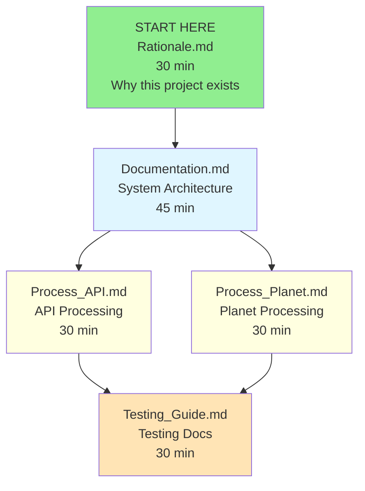

# Documentation Directory

## Overview

The `docs` directory contains comprehensive documentation for the OSM-Notes-Ingestion system,
including user guides, technical specifications, and implementation details. This documentation
helps users and contributors understand the system architecture and usage.

## Quick Start

**New to the project?** Start here:

1. **[Rationale.md](./Rationale.md)** (30 min) - Understand why this project exists
2. **[Documentation.md](./Documentation.md)** (45 min) - Learn the system architecture
3. **[Process_API.md](./Process_API.md)** (30 min) - Understand API processing

**Total time: ~2 hours** for a complete overview.

For detailed navigation paths by role, see
[Documentation Navigation Guide](#documentation-navigation-guide) below.

## Documentation Structure

### Core Documentation

- **`Documentation.md`**: Comprehensive system documentation and architecture overview
- **`Rationale.md`**: Project motivation, background, and design decisions
- **`Troubleshooting_Guide.md`**: Centralized troubleshooting guide for common problems and
  solutions
- **`Component_Dependencies.md`**: Component dependencies, relationships, and data flow diagrams
- **`External_Dependencies_And_Risks.md`**: External dependencies, risks, and potential impacts on
  the project

> **Note:** DWH (Data Warehouse), ETL, and Analytics documentation has been moved to
> [OSM-Notes-Analytics](https://github.com/OSM-Notes/OSM-Notes-Analytics).

### Technical Implementation

- **`Process_API.md`**: API processing documentation and incremental synchronization
- **`Process_Planet.md`**: Planet file processing documentation and historical data handling
- **`Base_Load_Progress_Monitoring.md`**: Operator runbook for long `processPlanetNotes.sh --base`
  steps (logs, SQL counts, completion flag)

### Spatial Processing

- **`Country_Assignment_2D_Grid.md`**: Country assignment strategy using 2D grid partitioning
- **`Capital_Validation_Explanation.md`**: Capital validation to prevent data cross-contamination
- **`ST_Dwithin_Explanation.md`**: PostGIS spatial functions explanation
- **`Maritime_Boundaries_Verification.md`**: Maritime boundaries verification using centroid-based
  approach

### Testing Documentation

- **`Testing_Guide.md`**: Complete testing guide with integration tests, troubleshooting, and best
  practices
- **`Testing_Workflows_Overview.md`**: Overview of GitHub Actions workflows and how to interpret
  results
- **`Input_Validation.md`**: Input validation and error handling documentation
- **`XML_Validation_Improvements.md`**: XML processing and validation improvements

For **WMS (Web Map Service) documentation**, see the
[OSM-Notes-WMS](https://github.com/OSM-Notes/OSM-Notes-WMS) repository.

### GDPR Compliance

- **`GDPR_Privacy_Policy.md`**: Comprehensive GDPR privacy policy covering data processing,
  retention, security, and data subject rights
- **`GDPR_Procedures.md`**: Detailed procedures for handling GDPR data subject requests (access,
  rectification, erasure, portability, objection)
- **`GDPR_Annual_Checklist.md`**: Annual compliance review checklist for GDPR maintenance

## Documentation Navigation Guide

### Visual Navigation Map

### Recommended Reading Paths by Role

#### For New Users (~2 hours total)

**Step 1: Project Context** (30 min)

- **[Rationale.md](./Rationale.md)** - Project purpose and motivation
  - Why this project exists
  - Problem statement
  - Historical context

**Step 2: System Overview** (45 min)

- **[Documentation.md](./Documentation.md)** - System architecture and overview
  - High-level architecture
  - Component relationships
  - Data flow

**Step 3: Processing Details** (60 min)

- **[Process_API.md](./Process_API.md)** - API processing (30 min)
  - Real-time synchronization
  - Incremental updates
- **[Process_Planet.md](./Process_Planet.md)** - Planet processing (30 min)
  - Historical data loading
  - Bulk processing

**Step 4: Advanced Topics** (45 min)

- **[Testing_Guide.md](./Testing_Guide.md)** - Testing procedures

#### For Developers (~3 hours total)

**Step 1: Foundation** (75 min)

- **[Rationale.md](./Rationale.md)** - Project context (30 min)
- **[Documentation.md](./Documentation.md)** - Architecture (45 min)

**Step 2: Core Implementation** (60 min)

- **[Process_API.md](./Process_API.md)** - API integration (30 min)
- **[Process_Planet.md](./Process_Planet.md)** - Data processing (30 min)

**Step 3: Advanced Topics** (30 min)

- **[Testing_Guide.md](./Testing_Guide.md)** - Testing procedures (30 min)

**Step 4: CI/CD** (30 min)

- **[Testing_Workflows_Overview.md](./Testing_Workflows_Overview.md)** - GitHub Actions workflows

#### For System Administrators (~2.5 hours total)

**Step 1: Deployment** (45 min)

- **[Documentation.md](./Documentation.md)** - Deployment guidelines
- **[LOCAL_SETUP.md](./Local_Setup.md)** - Local setup and directory installation

**Step 2: Operations** (60 min)

- **[Process_API.md](./Process_API.md)** - API operations (30 min)
- **[Process_Planet.md](./Process_Planet.md)** - Planet operations (30 min)

**Step 3: Monitoring** (30 min)

- **[Testing_Workflows_Overview.md](./Testing_Workflows_Overview.md)** - CI/CD pipeline
  understanding

#### For Testers and QA (~2 hours total)

**Step 1: Testing Foundation** (30 min)

- **[Testing_Guide.md](./Testing_Guide.md)** - Complete testing procedures

**Step 2: CI/CD Understanding** (30 min)

- **[Testing_Workflows_Overview.md](./Testing_Workflows_Overview.md)** - GitHub Actions workflows

**Step 3: Validation Testing** (60 min)

- **[Input_Validation.md](./Input_Validation.md)** - Validation guidelines (30 min)
- **[XML_Validation_Improvements.md](./XML_Validation_Improvements.md)** - XML testing (30 min)

## Documentation Cross-References

### Rationale.md

- **Purpose**: Project motivation and background
- **References**:
  - [Documentation.md](./Documentation.md) for technical details
  - [Process_API.md](./Process_API.md) and [Process_Planet.md](./Process_Planet.md) for
    implementation specifics

### Documentation.md

- **Purpose**: System architecture and technical overview
- **References**:
  - [Rationale.md](./Rationale.md) for project motivation
  - [Process_API.md](./Process_API.md) and [Process_Planet.md](./Process_Planet.md) for detailed
    implementation

### Testing Documentation

- **Testing_Guide.md**: Complete testing guide with integration tests and troubleshooting
- **Testing_Workflows_Overview.md**: GitHub Actions workflows explanation and interpretation
- **Input_Validation.md**: Input validation and error handling procedures
- **XML_Validation_Improvements.md**: XML processing and validation testing

### Process_API.md

- **Purpose**: API processing and incremental synchronization
- **References**:
  - [Documentation.md](./Documentation.md) for system architecture
  - [Rationale.md](./Rationale.md) for project background
  - [Process_Planet.md](./Process_Planet.md) for related processing workflows
  - [Troubleshooting_Guide.md](./Troubleshooting_Guide.md) for comprehensive troubleshooting
  - [Component_Dependencies.md](./Component_Dependencies.md) for component interactions
  - [Testing_Guide.md](./Testing_Guide.md) for testing procedures
  - [Country_Assignment_2D_Grid.md](./Country_Assignment_2D_Grid.md) for spatial processing details

### Process_Planet.md

- **Purpose**: Planet file processing and historical data handling
- **References**:
  - [Documentation.md](./Documentation.md) for system architecture
  - [Rationale.md](./Rationale.md) for project background
  - [Process_API.md](./Process_API.md) for related processing workflows
  - [Troubleshooting_Guide.md](./Troubleshooting_Guide.md) for comprehensive troubleshooting
  - [Component_Dependencies.md](./Component_Dependencies.md) for component interactions
  - [Testing_Guide.md](./Testing_Guide.md) for testing procedures
  - [Country_Assignment_2D_Grid.md](./Country_Assignment_2D_Grid.md) for country assignment strategy
  - [Capital_Validation_Explanation.md](./Capital_Validation_Explanation.md) for boundary validation
  - [ST_DWithin_Explanation.md](./ST_Dwithin_Explanation.md) for spatial functions

For **WMS (Web Map Service) documentation**, see the
[OSM-Notes-WMS](https://github.com/OSM-Notes/OSM-Notes-WMS) repository.

## Software Components

### System Documentation

- **Architecture Overview**: High-level system design and components
- **Data Flow**: How data moves through the system
- **Database Schema**: Table structures and relationships
- **API Integration**: OSM API usage and data processing

### Processing Documentation

- **API Processing**: Real-time data processing from OSM API
- **Planet Processing**: Large-scale data processing from Planet files

> **Note:** ETL Processes, Data Marts, and DWH features are maintained in
> [OSM-Notes-Analytics](https://github.com/OSM-Notes/OSM-Notes-Analytics).

### Technical Specifications

- **Performance Requirements**: System performance expectations
- **Security Considerations**: Data protection and access controls
- **Scalability**: System scaling and optimization strategies
- **Monitoring**: System monitoring and alerting procedures

## Usage Guidelines

### For System Administrators

- Monitor system health and performance
- Manage database maintenance and backups
- Configure processing schedules and timeouts
- Review [Documentation.md](./Documentation.md) for deployment guidelines

### For Developers

- Understand data flow and transformation processes
- Modify processing scripts and data ingestion procedures
- Study [Process_API.md](./Process_API.md) and [Process_Planet.md](./Process_Planet.md) for
  implementation details

> **Note:** For ETL procedures and analytics capabilities, see
> [OSM-Notes-Analytics](https://github.com/OSM-Notes/OSM-Notes-Analytics).

### For Data Analysts

- Query the notes database for custom analytics
- Review [Documentation.md](./Documentation.md) for data structure information

> **Note:** For data warehouse queries, data marts, and advanced analytics features (timezones,
> seasons, continents, application versions), see
> [OSM-Notes-Analytics](https://github.com/OSM-Notes/OSM-Notes-Analytics).

### For End Users

- View note activity and contribution metrics
- Read [Rationale.md](./Rationale.md) to understand the project's purpose

> **Note:** For interactive web visualization of user and country profiles, hashtag analysis, and
> campaign performance, see [OSM-Notes-Viewer](https://github.com/OSM-Notes/OSM-Notes-Viewer). For
> data warehouse and analytics backend, see
> [OSM-Notes-Analytics](https://github.com/OSM-Notes/OSM-Notes-Analytics).

## Dependencies

- Markdown rendering for proper display
- Diagrams and charts for visual documentation
- Code examples and configuration samples

## Contributing to Documentation

When updating documentation:

1. **Maintain Cross-References**: Update related document references
2. **Keep Language Consistent**: All documentation is now in English
3. **Test Links**: Verify all internal links work correctly
